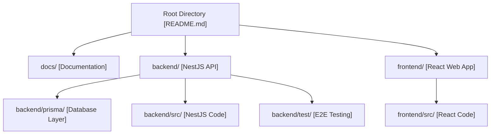

# AI-Powered FMEA Platform

An enterprise SaaS modular monolith system designed for quality engineering, implementing the complete **AIAG–VDA FMEA Handbook (2019)** methodology (DFMEA, PFMEA, Control Plans, Process Flow Diagrams, Action Priorities, and AI Copilot with RAG support).

---

## 🗺️ Repository Structure & Navigation Map

This repository is structured as a modular monolith. For ease of navigation and context optimization, every directory contains its own `README.md` index file defining file counts and file responsibilities.



### Key Components

1. 📂 **[Database Schema & Models](./backend/prisma/README.md)**
   - Database layer using PostgreSQL + pgvector and Prisma ORM.
2. 📂 **[Backend Service](./backend/README.md)**
   - NestJS modules, authentication, project workflows, actions dashboard, Cloudflare R2 file uploads.
3. 📂 **[Frontend Web App](./frontend/README.md)**
   - React 18 + TypeScript, Material-UI, TanStack grids, interactive Process Flow Diagrams, and Action Priority charts.
4. 📂 **[System Documentation](./docs/README.md)**
   - Software Architecture (SAD) and Technical Design (TDD) reference documents.

---

## 🚀 Getting Started

To deploy or run the platform locally, refer to the respective guides:
- 📖 **[First Time User Guide](./first_time_user_guide.md)**: Setup local variables and start developer services.
- 📖 **[Local Deployment Guide](./deployment_guide.md)**: Details on running Docker/Podman pods.
- 📖 **[Podman Deployment Guide](./podman_deployment_guide.md)**: Steps specifically for Podman desktop settings.

---

## 🧠 Context Window Optimization

This repository is configured with a workspace-level **customization skill** (`readme_sync`) located in `.agents/skills/readme_sync/`. 

- Every subfolder is indexed by a local `README.md` to prevent LLMs and agents from wasting token budget by loading large chunks of files just to understand directory roles.
- If you modify, add, or delete files, run the sync script to automatically update these indexes:
  ```powershell
  python .agents/skills/readme_sync/scripts/sync_readmes.py
  ```
