# AI-Powered FMEA Platform
## Software Architecture Document (SAD) & Technical Design Document (TDD)

| **Document ID** | FMEA-SAD-TDD-2026-001 |
|---|---|
| **Version** | 1.0 |
| **Date** | 2026-06-24 |
| **Status** | Draft for Development Team Review |
| **Classification** | Internal — Confidential |
| **Source** | Synthesized from Notion project workspace (11 pages) |

---

## Table of Contents

1. [Executive Summary](#1-executive-summary)
2. [Business Context & Objectives](#2-business-context--objectives)
3. [System Overview](#3-system-overview)
4. [Architectural Views](#4-architectural-views)
   - 4.1 [Context View (C4 Level 1)](#41-context-view-c4-level-1)
   - 4.2 [Container View (C4 Level 2)](#42-container-view-c4-level-2)
   - 4.3 [Component View (C4 Level 3)](#43-component-view-c4-level-3)
   - 4.4 [Deployment View](#44-deployment-view)
5. [Domain Model & Core Entities](#5-domain-model--core-entities)
6. [Module Architecture](#6-module-architecture)
7. [Database Design](#7-database-design)
8. [API Architecture](#8-api-architecture)
9. [AI Copilot Architecture](#9-ai-copilot-architecture)
10. [Workflow & State Machine Design](#10-workflow--state-machine-design)
11. [Frontend Architecture](#11-frontend-architecture)
12. [Security Architecture](#12-security-architecture)
13. [Cross-Cutting Concerns](#13-cross-cutting-concerns)
14. [Integration Architecture](#14-integration-architecture)
15. [Implementation Roadmap](#15-implementation-roadmap)
16. [Testing Strategy](#16-testing-strategy)
17. [Appendices](#17-appendices)

---

## 1. Executive Summary

### 1.1 Purpose

This document provides the definitive software architecture and technical design for the **AI-Powered FMEA Platform** — a multi-tenant, cloud-native SaaS system for automotive and manufacturing quality engineering. It consolidates all requirements, designs, and specifications from the Notion project workspace into a single actionable reference for the development team.

### 1.2 Scope

The platform implements the complete **AIAG–VDA FMEA Handbook (2019)** methodology including:

- **DFMEA** (Design FMEA) and **PFMEA** (Process FMEA) with the 7-step process
- **Control Plans** auto-generated from PFMEA controls
- **Process Flow Diagrams (PFD)** with bidirectional FMEA linkage
- **P-Diagrams**, **Fault Trees**, and **Event Trees**
- **Action Priority (AP)** ratings replacing legacy RPN
- **AI Copilot** with RAG-based suggestions (7 specialized agents)
- **Full revision control**, approval workflows, and immutable audit trails
- **Multi-tenant isolation** with RBAC and row-level security

### 1.3 Audience

| Role | How to Use This Document |
|---|---|
| Backend Engineers | Sections 6–8, 10, 12–14 |
| Frontend Engineers | Sections 6, 8, 11 |
| AI/ML Engineers | Section 9 |
| DevOps/SRE | Sections 4.4, 13 |
| QA Engineers | Section 16 |
| Tech Leads / Architects | All sections |
| Product Managers | Sections 1–3, 15 |

### 1.4 Key Architectural Decisions

| # | Decision | Rationale |
|---|---|---|
| ADR-01 | **NestJS (TypeScript)** for backend | Type safety, decorator-based architecture, excellent module system, aligns with frontend TypeScript |
| ADR-02 | **React 18 + TypeScript** for frontend | Component ecosystem maturity, TanStack Table for FMEA grids, Material-UI for enterprise UX |
| ADR-03 | **PostgreSQL 15+ with pgvector** | Single DB for transactional + vector data; simplifies ops; row-level security for multi-tenant |
| ADR-04 | **REST + GraphQL** dual API | REST for CRUD/auth/export; GraphQL for complex FMEA queries with nested entity resolution |
| ADR-05 | **Human-in-the-loop AI** | AI suggests with confidence/rationale/citations; never modifies approved data without explicit user action |
| ADR-06 | **Event sourcing for audit** | Immutable audit trail via append-only `audit_log` table; meets IATF 16949 evidence requirements |
| ADR-07 | **Revision-based document model** | All FMEA documents use immutable revisions; approved revisions are locked; new changes create new revisions |
| ADR-08 | **Microservices-ready monolith** | Start as modular monolith (NestJS modules); extract to microservices when scale demands |

---

## 2. Business Context & Objectives

### 2.1 Problem Statement

Automotive and manufacturing companies currently manage FMEA using Excel spreadsheets, legacy desktop tools, or fragmented systems that:
- Cannot enforce the AIAG–VDA 7-step methodology
- Lack bidirectional linkage between PFD ↔ PFMEA ↔ Control Plan ↔ Actions
- Provide no AI assistance for accelerating FMEA authoring
- Cannot maintain immutable audit trails for IATF 16949 compliance
- Do not support multi-plant, multi-team collaboration

### 2.2 Vision Statement

Build an **enterprise SaaS platform** that:
- Embeds the AIAG–VDA 7-step methodology natively
- Links DFMEA ↔ PFMEA ↔ Control Plan ↔ PFD ↔ Actions ↔ Revisions ↔ Approvals
- Uses AI to accelerate authoring while keeping engineers in control
- Provides full audit trails for IATF 16949 compliance
- Feels like a modern SaaS tool (think Jira/Asana for quality engineers)

### 2.3 Key Differentiators

1. **AIAG–VDA Native**: 7-step process, AP ratings, structured templates built in
2. **AI-Assisted**: Copilot suggests failures, causes, controls, ratings — engineers approve
3. **Always-in-Sync Linkage**: Change a PFMEA row → see impact on Control Plan instantly
4. **Knowledge Reuse**: Master FMEAs and templates reduce rework across programs
5. **Audit-Ready**: Immutable history, approvals, action closure evidence

### 2.4 Target Users

| User Role | Primary Activities |
|---|---|
| **Quality Engineers** | Create and maintain FMEAs, Control Plans, PFDs |
| **Reviewers** | Provide feedback on risk analysis |
| **Approvers** | Sign off on completed FMEA revisions |
| **Managers** | Track open risks and action items |
| **Auditors** (external) | Verify IATF 16949 compliance |

### 2.5 Standards Compliance

| Standard | Requirement |
|---|---|
| **AIAG–VDA FMEA Handbook 2019** | 7-step process, AP rating tables, structured templates |
| **IATF 16949** | Documented risk analysis, revision control, audit evidence, action tracking |
| **ISO 9001:2015** | Quality management system foundation |

---

## 3. System Overview

### 3.1 Core Modules

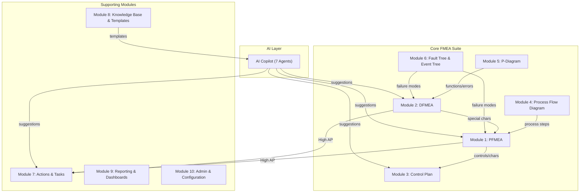

### 3.2 Interlinkage Model

Every core artifact is bidirectionally linked:

```
PFD Step 30: "Drill hole"
    ↕
PFMEA Row: Function → Failure Mode → Effect → Cause → Control
    ↕                                                    ↕
DFMEA Row: (special characteristics flow down)    Control Plan Row
    ↕                                                    ↕
P-Diagram: (error states → failure modes)         Reaction Plan
    ↕
Fault Tree: (basic events = failure modes)
    ↕
Actions: (High AP → corrective action → evidence → re-rate)
    ↕
Revisions: (immutable snapshots with approval workflow)
    ↕
Audit Trail: (who, when, what, before/after values)
```

### 3.3 Functional Requirements Summary

The PRD specifies **160+ requirements** across 9 categories:

| Category | Count | Key Requirements |
|---|---|---|
| **FR-PROJ** Project Management | 15 | Multi-plant hierarchy, document lifecycle, team management |
| **FR-PFD** Process Flow Diagram | 12 | Tabular + visual editor, step numbering, drag-drop reorder |
| **FR-PFMEA** Process FMEA | 25 | 7-step methodology, AP calculation, row-level CRUD, inline AI |
| **FR-DFMEA** Design FMEA | 20 | Structure tree, P-diagram linkage, special characteristics |
| **FR-CP** Control Plan | 15 | Auto-generation from PFMEA, bidirectional sync, reaction plans |
| **FR-ACT** Actions | 12 | Before/after ratings, evidence upload, effectiveness verification |
| **FR-AI** AI Copilot | 18 | RAG-based suggestions, 7 agents, confidence/rationale/citations |
| **FR-RPT** Reporting | 10 | AP distribution, risk heatmaps, action dashboards, Excel/PDF export |
| **FR-ADMIN** Administration | 15 | Tenant setup, RBAC, rating scale config, AP table config |

---

## 4. Architectural Views

### 4.1 Context View (C4 Level 1)

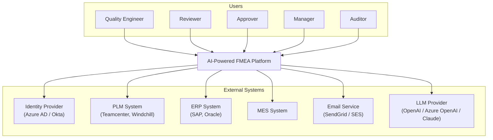

### 4.2 Container View (C4 Level 2)

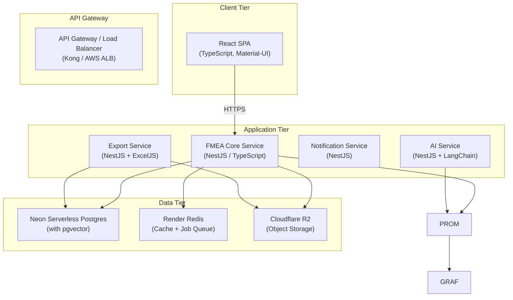

### 4.3 Component View (C4 Level 3) — FMEA Core Service

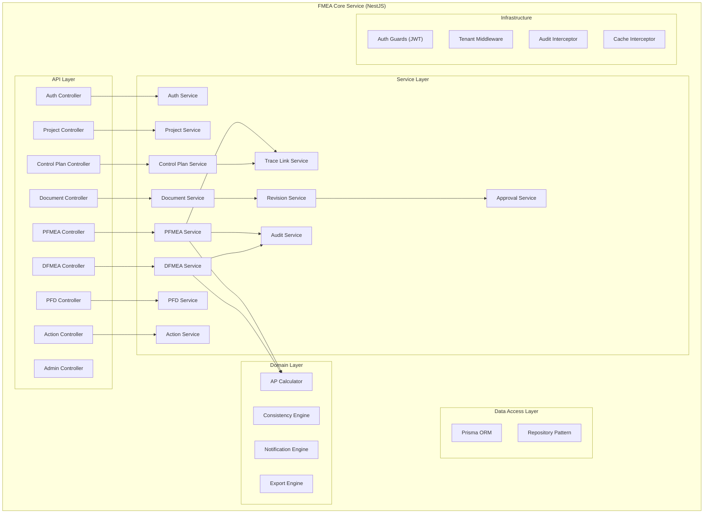

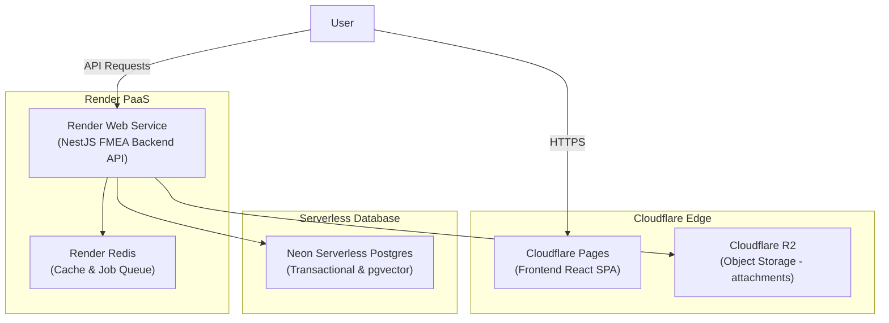

**Resource Sizing (Render / Neon / R2):**

| Component | Provider / Plan | CPU / Memory | Storage | Purpose |
|---|---|---|---|---|
| Frontend React SPA | Cloudflare Pages | Edge Network | — | Web static asset hosting |
| FMEA Backend API | Render Web Service | 1 vCPU / 2 GB | — | NestJS application logic |
| Redis Cache & Queue | Render Redis | Shared | — | Job queue & session cache |
| PostgreSQL Database | Neon Serverless | Dynamic (Autoscale) | Autoscale | Postgres 15 database + pgvector |
| Attachment Storage | Cloudflare R2 | S3-Compatible Edge | Unlimited | Action evidence & exports |

---

## 5. Domain Model & Core Entities

### 5.1 Entity Relationship Overview

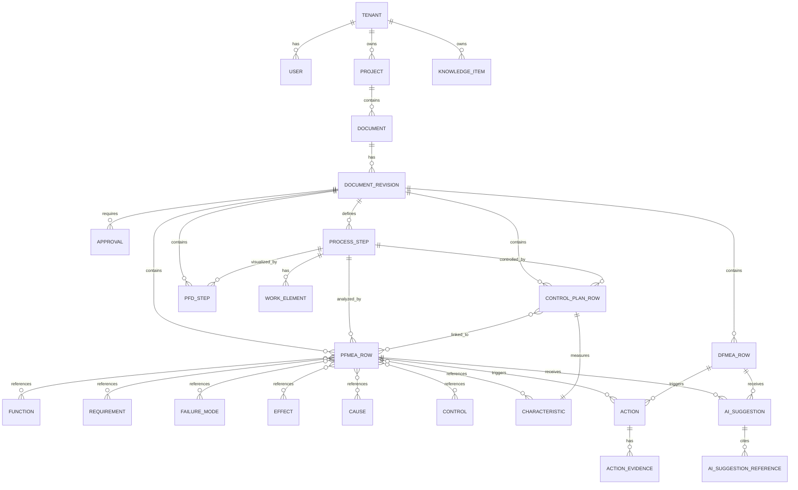

### 5.2 Core Entity Definitions

#### 5.2.1 Organizational Entities

| Entity | Description | Key Attributes |
|---|---|---|
| **Tenant** | Isolated customer organization | `id`, `name`, `subdomain`, `plan`, `status`, `settings` |
| **User** | Platform user within a tenant | `id`, `tenant_id`, `email`, `name`, `status`, `mfa_enabled` |
| **Role** | RBAC role definition | `id`, `tenant_id`, `name`, `permissions[]` |
| **Plant** | Manufacturing facility | `id`, `tenant_id`, `name`, `location`, `code` |
| **Product Family** | Product grouping | `id`, `tenant_id`, `name`, `customer` |

#### 5.2.2 Document Entities

| Entity | Description | Key Attributes |
|---|---|---|
| **Project** | Container for related FMEA documents | `id`, `tenant_id`, `name`, `customer`, `plant_id`, `product_family_id`, `status` |
| **Document** | Versioned FMEA document | `id`, `project_id`, `type` (PFMEA/DFMEA/CP/PFD), `current_revision_id` |
| **Document Revision** | Immutable snapshot | `id`, `document_id`, `revision_number`, `status`, `effective_from`, `summary` |
| **Approval** | Sign-off record | `id`, `revision_id`, `approver_id`, `decision`, `comment`, `timestamp` |

#### 5.2.3 FMEA Entities

| Entity | Description | Key Attributes |
|---|---|---|
| **Process Item** | Top-level process being analyzed | `id`, `project_id`, `name`, `description` |
| **Process Step** | Individual operation | `id`, `revision_id`, `process_item_id`, `step_number`, `name`, `sequence_order` |
| **Work Element** | Sub-task of a process step | `id`, `process_step_id`, `name`, `description` |
| **Function** | What the step/component should do | `id`, `tenant_id`, `name`, `description`, `is_template` |
| **Requirement** | Measurable specification | `id`, `tenant_id`, `name`, `spec`, `tolerance`, `is_template` |
| **Failure Mode** | How it can fail | `id`, `tenant_id`, `name`, `description`, `is_template` |
| **Effect** | Impact of failure | `id`, `tenant_id`, `name`, `description`, `level` (local/next/customer) |
| **Cause** | Root cause of failure | `id`, `tenant_id`, `name`, `description`, `is_template` |
| **Control** | Prevention or detection measure | `id`, `tenant_id`, `name`, `type` (prevention/detection), `is_template` |
| **Characteristic** | Measurable feature (dimension, etc.) | `id`, `tenant_id`, `name`, `classification` (standard/special/critical) |

#### 5.2.4 Row Entities

| Entity | Description | Key Attributes |
|---|---|---|
| **PFMEA Row** | One row in PFMEA table | `id`, `revision_id`, `process_step_id`, `severity`, `occurrence`, `detection`, `ap`, `status` |
| **DFMEA Row** | One row in DFMEA table | `id`, `revision_id`, `structure_element`, `severity`, `occurrence`, `detection`, `ap`, `status` |
| **Control Plan Row** | One row in CP table | `id`, `revision_id`, `process_step_id`, `characteristic_id`, `spec_tolerance`, `measurement_method`, `sample_size`, `frequency`, `control_type`, `reaction_plan` |

### 5.3 Action Priority (AP) Calculation

The AP rating replaces legacy RPN. It uses a lookup table mapping (S, O, D) → H/M/L:

```
AP Priority Logic (AIAG–VDA 2019 Table):

IF Severity ≥ 9:
  IF Occurrence ≥ 2: AP = H  (regardless of Detection)
  IF Occurrence = 1 AND Detection ≥ 4: AP = H
  IF Occurrence = 1 AND Detection ≤ 3: AP = M

IF Severity = 7-8:
  IF Occurrence ≥ 5: AP = H
  IF Occurrence = 3-4 AND Detection ≥ 5: AP = H
  IF Occurrence = 3-4 AND Detection ≤ 4: AP = M
  IF Occurrence ≤ 2 AND Detection ≥ 5: AP = M
  IF Occurrence ≤ 2 AND Detection ≤ 4: AP = L

(... full 10×10×10 lookup table stored in configuration)
```

The AP table is **configurable per tenant** to allow customization while defaulting to the AIAG–VDA standard.

---

## 6. Module Architecture

### 6.1 Module 1: PFMEA (Process FMEA)

**Purpose:** Analyze manufacturing process steps for potential failures using the AIAG–VDA 7-step methodology.

**NestJS Module Structure:**
```
src/modules/pfmea/
├── pfmea.module.ts
├── controllers/
│   ├── pfmea-row.controller.ts       # CRUD for PFMEA rows
│   ├── process-step.controller.ts     # Process structure management
│   └── work-element.controller.ts     # Work element management
├── services/
│   ├── pfmea-row.service.ts          # Business logic for rows
│   ├── ap-calculator.service.ts      # AP rating computation
│   ├── pfmea-linkage.service.ts      # PFD↔PFMEA↔CP linking
│   └── pfmea-export.service.ts       # Excel/PDF export
├── dto/
│   ├── create-pfmea-row.dto.ts
│   ├── update-pfmea-row.dto.ts
│   └── pfmea-filter.dto.ts
├── entities/
│   ├── pfmea-row.entity.ts
│   ├── process-step.entity.ts
│   └── work-element.entity.ts
└── guards/
    └── pfmea-permission.guard.ts
```

**7-Step Process Enforcement:**

| Step | System Behavior |
|---|---|
| **Step 1: Planning** | Project creation wizard enforces 5Ts (Intent, Timing, Team, Tasks, Tools) |
| **Step 2: Structure Analysis** | Tree editor for Process Item → Steps → Work Elements. Must be completed before Step 3. |
| **Step 3: Function Analysis** | Function/requirement association to steps. AI suggests from templates. |
| **Step 4: Failure Analysis** | Failure mode → effect → cause chains. AI drafts full chains from PFD. |
| **Step 5: Risk Analysis** | S/O/D rating with AI suggestions. AP auto-calculated. |
| **Step 6: Optimization** | Action creation for High AP items. Before/after tracking. |
| **Step 7: Results Documentation** | Submission → Review → Approval → Export workflow. |

**Key Business Rules:**
- Every PFMEA row MUST link to a Process Step (NOT NULL)
- Each failure mode MUST have at least one effect and one cause
- Each cause MUST have at least one prevention OR detection control
- AP is auto-calculated and cannot be manually overridden
- Severity is inherited from the highest effect level

---

### 6.2 Module 2: DFMEA (Design FMEA)

**Purpose:** Analyze product design for potential failures.

**Structure:**
```
src/modules/dfmea/
├── dfmea.module.ts
├── controllers/
│   ├── dfmea-row.controller.ts
│   ├── structure-element.controller.ts  # System→Subsystem→Component tree
│   └── p-diagram.controller.ts          # Parameter diagram management
├── services/
│   ├── dfmea-row.service.ts
│   ├── structure-analysis.service.ts
│   ├── p-diagram.service.ts
│   └── dfmea-pfmea-link.service.ts      # Special characteristics flow
├── dto/ ...
└── entities/ ...
```

**DFMEA ↔ PFMEA Linkage:**
- DFMEA identifies **Special Characteristics** (critical dimensions/properties)
- These flow down to PFMEA as mandatory coverage items
- System detects and alerts on gaps: "DFMEA special char X has no PFMEA coverage"

---

### 6.3 Module 3: Control Plan

**Purpose:** Document how manufacturing will control the process to prevent defects.

**Structure:**
```
src/modules/control-plan/
├── control-plan.module.ts
├── controllers/
│   └── control-plan-row.controller.ts
├── services/
│   ├── control-plan-row.service.ts
│   ├── cp-generation.service.ts         # Auto-generate from PFMEA
│   └── cp-sync.service.ts              # Bidirectional PFMEA sync
├── dto/ ...
└── entities/ ...
```

**Auto-Generation Logic:**
```
For each PFMEA Row with controls:
  For each Control:
    For each linked Characteristic:
      Create CP Row:
        - process_step_id = PFMEA row's process_step_id
        - characteristic_id = characteristic.id
        - measurement_method = control.detection_method (if detection)
        - control_type = control.type (prevention/detection)
        - sample_size = DEFAULT from template
        - frequency = DEFAULT from template
        - reaction_plan = DEFAULT from template
      Create trace_link:
        - from_type = 'control_plan_row', from_id = cp_row.id
        - to_type = 'pfmea_row', to_id = pfmea_row.id
```

---

### 6.4 Module 4: Process Flow Diagram (PFD)

**Purpose:** Visual and tabular representation of manufacturing process flow.

**Structure:**
```
src/modules/pfd/
├── pfd.module.ts
├── controllers/
│   └── pfd-step.controller.ts
├── services/
│   ├── pfd-step.service.ts
│   ├── pfd-visual.service.ts           # Diagram rendering data
│   └── pfd-gap-analysis.service.ts     # Detect PFD steps without PFMEA coverage
├── dto/ ...
└── entities/ ...
```

**Gap Detection:**
The system continuously monitors for:
- PFD steps without any PFMEA rows (warning)
- PFMEA rows referencing process steps not in PFD (error)
- Sequence mismatches between PFD and PFMEA ordering

---

### 6.5 Module 5: P-Diagram (Parameter Diagram)

**Purpose:** Visual tool for DFMEA mapping inputs, outputs, noise factors, and control factors.

**Key Entities:**
- **Ideal Function**: What the system should do
- **Inputs**: Energy, material, signals
- **Outputs**: Desired response
- **Noise Factors**: Uncontrollable variables (temperature, humidity, wear)
- **Control Factors**: Design parameters that can be set
- **Error States**: Unintended outputs (map to DFMEA failure modes)

**Linkage to DFMEA:**
- P-diagram outputs → DFMEA functions
- P-diagram error states → DFMEA failure modes
- AI auto-suggests DFMEA rows from P-diagram

---

### 6.6 Module 6: Fault Tree & Event Tree

**Purpose:** Logical diagrams for complex failure scenario analysis.

- **Fault Tree**: Top-down; starts with failure → traces to root causes via AND/OR gates
- **Event Tree**: Forward; starts with initiating event → branches to outcomes

**Linkage to FMEA:**
- Fault tree basic events link to DFMEA/PFMEA failure modes
- Combined probability and impact calculation

---

### 6.7 Module 7: Actions & Tasks

**Purpose:** Track corrective and preventive actions for high-risk FMEA rows.

**Structure:**
```
src/modules/actions/
├── actions.module.ts
├── controllers/
│   └── action.controller.ts
├── services/
│   ├── action.service.ts
│   ├── action-effectiveness.service.ts  # Before/after rating comparison
│   └── action-notification.service.ts   # Due date reminders
├── dto/ ...
└── entities/ ...
```

**Action Lifecycle:**
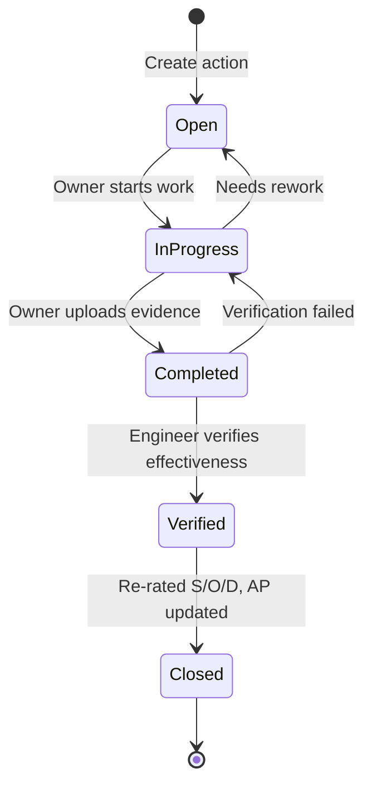

**Before/After Tracking:**
```
Action: "Implement tool wear monitoring system"
  PFMEA Row Before: S=8, O=5, D=6, AP=H
  PFMEA Row After:  S=8, O=2, D=6, AP=M  ← Occurrence reduced
  Evidence: Tool wear monitoring SOP v2.pdf, Test report #TR-2026-045
```

---

### 6.8 Module 8: Knowledge Base & Templates

**Purpose:** Library of reusable FMEA patterns.

**Template Types:**
1. **Complete FMEA Template**: Full process structure with pre-populated rows (e.g., "CNC Milling PFMEA")
2. **Master FMEA**: Foundation FMEA for common processes
3. **Knowledge Items**: Individual building blocks (standard failure modes, causes, controls)

**AI Integration:**
- Knowledge items are embedded and indexed in pgvector
- RAG queries retrieve relevant items during FMEA authoring
- Users can promote good FMEA content to templates via "Save as Template" action

---

### 6.9 Module 9: Reporting & Dashboards

**Key Dashboards:**

| Dashboard | Content |
|---|---|
| **Risk Dashboard** | AP distribution (H/M/L pie chart), top 10 high-risk items, trend over time |
| **Action Dashboard** | Overdue actions, open actions by owner, closure rate |
| **Compliance Dashboard** | Approval status, revision history, audit-ready evidence |
| **Coverage Dashboard** | PFD→PFMEA coverage, PFMEA→CP coverage, DFMEA→PFMEA trace |

**Export Formats:**
- **Excel**: AIAG–VDA formatted FMEA workbook (ExcelJS)
- **PDF**: Print-ready FMEA report (Puppeteer/PDFKit)
- **CSV**: Data export for external analysis

---

### 6.10 Module 10: Admin & Configuration

**Configuration Capabilities:**
- Tenant/plant/product family hierarchy
- User roles and permissions (RBAC)
- S/O/D rating scale descriptions (1–10 with customizable text per level)
- AP lookup table (S×O×D → H/M/L mapping, configurable per tenant)
- Workflow step configuration (reviewers, approvers)
- Integration endpoints (SSO, PLM, ERP, MES)
- AI model selection and parameters

---

## 7. Database Design

### 7.1 Technology

- **PostgreSQL 15+** with `pgvector` extension for vector similarity search
- **Prisma ORM** for type-safe database access
- **Row-Level Security (RLS)** for multi-tenant data isolation
- **UUID v7** for all primary keys (time-ordered for index performance)

### 7.2 Schema Overview

The database consists of **35+ tables** organized into 8 domains:

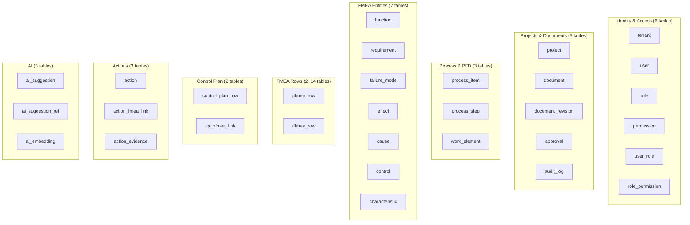

### 7.3 Complete DDL (Core Tables)

#### 7.3.1 Identity & Access

```sql
-- Tenant: top-level organizational boundary
CREATE TABLE tenant (
    id              UUID PRIMARY KEY DEFAULT gen_random_uuid(),
    name            VARCHAR(255) NOT NULL,
    subdomain       VARCHAR(63) NOT NULL UNIQUE,
    plan            VARCHAR(50) NOT NULL DEFAULT 'standard',
    status          VARCHAR(20) NOT NULL DEFAULT 'active',
    settings        JSONB NOT NULL DEFAULT '{}',
    created_at      TIMESTAMPTZ NOT NULL DEFAULT now(),
    updated_at      TIMESTAMPTZ NOT NULL DEFAULT now(),
    CONSTRAINT chk_tenant_status CHECK (status IN ('active','suspended','archived'))
);

-- User: authenticated platform user
CREATE TABLE "user" (
    id              UUID PRIMARY KEY DEFAULT gen_random_uuid(),
    tenant_id       UUID NOT NULL REFERENCES tenant(id),
    email           VARCHAR(255) NOT NULL,
    name            VARCHAR(255) NOT NULL,
    password_hash   VARCHAR(255),
    avatar_url      VARCHAR(500),
    status          VARCHAR(20) NOT NULL DEFAULT 'active',
    mfa_enabled     BOOLEAN NOT NULL DEFAULT FALSE,
    last_login_at   TIMESTAMPTZ,
    created_at      TIMESTAMPTZ NOT NULL DEFAULT now(),
    updated_at      TIMESTAMPTZ NOT NULL DEFAULT now(),
    UNIQUE (tenant_id, email),
    CONSTRAINT chk_user_status CHECK (status IN ('active','invited','disabled'))
);

-- Role: RBAC role definition
CREATE TABLE role (
    id              UUID PRIMARY KEY DEFAULT gen_random_uuid(),
    tenant_id       UUID NOT NULL REFERENCES tenant(id),
    name            VARCHAR(100) NOT NULL,
    description     TEXT,
    is_system       BOOLEAN NOT NULL DEFAULT FALSE,
    created_at      TIMESTAMPTZ NOT NULL DEFAULT now(),
    UNIQUE (tenant_id, name)
);

-- Permission: atomic permission
CREATE TABLE permission (
    id              UUID PRIMARY KEY DEFAULT gen_random_uuid(),
    code            VARCHAR(100) NOT NULL UNIQUE,
    description     TEXT,
    module          VARCHAR(50) NOT NULL
);

-- User-Role mapping
CREATE TABLE user_role (
    user_id         UUID NOT NULL REFERENCES "user"(id) ON DELETE CASCADE,
    role_id         UUID NOT NULL REFERENCES role(id) ON DELETE CASCADE,
    granted_at      TIMESTAMPTZ NOT NULL DEFAULT now(),
    granted_by      UUID REFERENCES "user"(id),
    PRIMARY KEY (user_id, role_id)
);

-- Role-Permission mapping
CREATE TABLE role_permission (
    role_id         UUID NOT NULL REFERENCES role(id) ON DELETE CASCADE,
    permission_id   UUID NOT NULL REFERENCES permission(id) ON DELETE CASCADE,
    PRIMARY KEY (role_id, permission_id)
);
```

#### 7.3.2 Projects & Documents

```sql
-- Project: container for related FMEA documents
CREATE TABLE project (
    id                  UUID PRIMARY KEY DEFAULT gen_random_uuid(),
    tenant_id           UUID NOT NULL REFERENCES tenant(id),
    name                VARCHAR(255) NOT NULL,
    description         TEXT,
    customer            VARCHAR(255),
    plant_id            UUID,
    product_family_id   UUID,
    model_year          VARCHAR(10),
    status              VARCHAR(20) NOT NULL DEFAULT 'active',
    team_lead_id        UUID REFERENCES "user"(id),
    created_by          UUID NOT NULL REFERENCES "user"(id),
    created_at          TIMESTAMPTZ NOT NULL DEFAULT now(),
    updated_at          TIMESTAMPTZ NOT NULL DEFAULT now(),
    CONSTRAINT chk_project_status CHECK (status IN ('active','on_hold','completed','archived'))
);

CREATE INDEX idx_project_tenant ON project(tenant_id);
CREATE INDEX idx_project_status ON project(tenant_id, status);

-- Document: versioned FMEA document
CREATE TABLE document (
    id                  UUID PRIMARY KEY DEFAULT gen_random_uuid(),
    tenant_id           UUID NOT NULL REFERENCES tenant(id),
    project_id          UUID NOT NULL REFERENCES project(id),
    type                VARCHAR(20) NOT NULL,
    name                VARCHAR(255) NOT NULL,
    current_revision_id UUID,
    status              VARCHAR(20) NOT NULL DEFAULT 'active',
    created_by          UUID NOT NULL REFERENCES "user"(id),
    created_at          TIMESTAMPTZ NOT NULL DEFAULT now(),
    updated_at          TIMESTAMPTZ NOT NULL DEFAULT now(),
    CONSTRAINT chk_doc_type CHECK (type IN ('PFMEA','DFMEA','CONTROL_PLAN','PFD','P_DIAGRAM','FAULT_TREE','EVENT_TREE'))
);

CREATE INDEX idx_document_project ON document(project_id);
CREATE INDEX idx_document_tenant_type ON document(tenant_id, type);

-- Document Revision: immutable snapshot
CREATE TABLE document_revision (
    id                  UUID PRIMARY KEY DEFAULT gen_random_uuid(),
    document_id         UUID NOT NULL REFERENCES document(id),
    revision_number     VARCHAR(20) NOT NULL,
    status              VARCHAR(20) NOT NULL DEFAULT 'draft',
    summary             TEXT,
    change_description  TEXT,
    effective_from      DATE,
    effective_to        DATE,
    created_by          UUID NOT NULL REFERENCES "user"(id),
    created_at          TIMESTAMPTZ NOT NULL DEFAULT now(),
    submitted_at        TIMESTAMPTZ,
    approved_at         TIMESTAMPTZ,
    locked_at           TIMESTAMPTZ,
    UNIQUE (document_id, revision_number),
    CONSTRAINT chk_rev_status CHECK (status IN (
        'draft','in_review','changes_requested','approved','superseded','archived'
    ))
);

CREATE INDEX idx_revision_document ON document_revision(document_id);
CREATE INDEX idx_revision_status ON document_revision(status);

-- Approval: sign-off record
CREATE TABLE approval (
    id                  UUID PRIMARY KEY DEFAULT gen_random_uuid(),
    revision_id         UUID NOT NULL REFERENCES document_revision(id),
    approver_id         UUID NOT NULL REFERENCES "user"(id),
    role                VARCHAR(50) NOT NULL, -- 'reviewer', 'approver'
    decision            VARCHAR(20),
    comment             TEXT,
    decided_at          TIMESTAMPTZ,
    created_at          TIMESTAMPTZ NOT NULL DEFAULT now(),
    CONSTRAINT chk_approval_decision CHECK (decision IN ('approved','rejected','changes_requested'))
);

CREATE INDEX idx_approval_revision ON approval(revision_id);

-- Audit Log: immutable change log
CREATE TABLE audit_log (
    id                  UUID PRIMARY KEY DEFAULT gen_random_uuid(),
    tenant_id           UUID NOT NULL,
    entity_type         VARCHAR(50) NOT NULL,
    entity_id           UUID NOT NULL,
    action              VARCHAR(20) NOT NULL,
    old_value           JSONB,
    new_value           JSONB,
    diff                JSONB,
    user_id             UUID NOT NULL,
    ip_address          INET,
    user_agent          TEXT,
    timestamp           TIMESTAMPTZ NOT NULL DEFAULT now(),
    CONSTRAINT chk_audit_action CHECK (action IN ('create','update','delete','approve','reject','submit','lock'))
);

-- Partitioned by month for performance
-- CREATE TABLE audit_log ... PARTITION BY RANGE (timestamp);

CREATE INDEX idx_audit_entity ON audit_log(entity_type, entity_id);
CREATE INDEX idx_audit_tenant_ts ON audit_log(tenant_id, timestamp DESC);
CREATE INDEX idx_audit_user ON audit_log(user_id, timestamp DESC);
```

#### 7.3.3 Process & PFD

```sql
-- Process Item: top-level process
CREATE TABLE process_item (
    id              UUID PRIMARY KEY DEFAULT gen_random_uuid(),
    tenant_id       UUID NOT NULL REFERENCES tenant(id),
    project_id      UUID NOT NULL REFERENCES project(id),
    name            VARCHAR(255) NOT NULL,
    description     TEXT,
    created_at      TIMESTAMPTZ NOT NULL DEFAULT now(),
    updated_at      TIMESTAMPTZ NOT NULL DEFAULT now()
);

-- Process Step: individual operation
CREATE TABLE process_step (
    id                  UUID PRIMARY KEY DEFAULT gen_random_uuid(),
    revision_id         UUID NOT NULL REFERENCES document_revision(id),
    process_item_id     UUID NOT NULL REFERENCES process_item(id),
    step_number         VARCHAR(20) NOT NULL,
    name                VARCHAR(255) NOT NULL,
    description         TEXT,
    step_type           VARCHAR(30) NOT NULL DEFAULT 'operation',
    sequence_order      INTEGER NOT NULL,
    inputs              TEXT,
    outputs             TEXT,
    resources           TEXT,
    created_at          TIMESTAMPTZ NOT NULL DEFAULT now(),
    updated_at          TIMESTAMPTZ NOT NULL DEFAULT now(),
    CONSTRAINT chk_step_type CHECK (step_type IN (
        'operation','inspection','transport','storage','delay','rework','decision'
    ))
);

CREATE INDEX idx_process_step_revision ON process_step(revision_id);
CREATE INDEX idx_process_step_sequence ON process_step(revision_id, sequence_order);

-- Work Element: sub-task
CREATE TABLE work_element (
    id                  UUID PRIMARY KEY DEFAULT gen_random_uuid(),
    process_step_id     UUID NOT NULL REFERENCES process_step(id) ON DELETE CASCADE,
    name                VARCHAR(255) NOT NULL,
    description         TEXT,
    sequence_order      INTEGER NOT NULL,
    created_at          TIMESTAMPTZ NOT NULL DEFAULT now()
);

-- PFD Step: visual/graphical data for PFD
CREATE TABLE pfd_step (
    id                  UUID PRIMARY KEY DEFAULT gen_random_uuid(),
    revision_id         UUID NOT NULL REFERENCES document_revision(id),
    process_step_id     UUID NOT NULL REFERENCES process_step(id),
    position_x          FLOAT,
    position_y          FLOAT,
    graphical_data      JSONB,
    created_at          TIMESTAMPTZ NOT NULL DEFAULT now()
);
```

#### 7.3.4 FMEA Core Entities

```sql
-- Function: what the step/component should do
CREATE TABLE function (
    id              UUID PRIMARY KEY DEFAULT gen_random_uuid(),
    tenant_id       UUID NOT NULL REFERENCES tenant(id),
    name            VARCHAR(500) NOT NULL,
    description     TEXT,
    is_template     BOOLEAN NOT NULL DEFAULT FALSE,
    source          VARCHAR(50) DEFAULT 'manual',
    created_at      TIMESTAMPTZ NOT NULL DEFAULT now()
);

-- Requirement: measurable specification
CREATE TABLE requirement (
    id              UUID PRIMARY KEY DEFAULT gen_random_uuid(),
    tenant_id       UUID NOT NULL REFERENCES tenant(id),
    name            VARCHAR(500) NOT NULL,
    description     TEXT,
    spec            VARCHAR(255),
    tolerance       VARCHAR(100),
    is_template     BOOLEAN NOT NULL DEFAULT FALSE,
    created_at      TIMESTAMPTZ NOT NULL DEFAULT now()
);

-- Failure Mode: how it can fail
CREATE TABLE failure_mode (
    id              UUID PRIMARY KEY DEFAULT gen_random_uuid(),
    tenant_id       UUID NOT NULL REFERENCES tenant(id),
    name            VARCHAR(500) NOT NULL,
    description     TEXT,
    is_template     BOOLEAN NOT NULL DEFAULT FALSE,
    created_at      TIMESTAMPTZ NOT NULL DEFAULT now()
);

-- Effect: impact of failure
CREATE TABLE effect (
    id              UUID PRIMARY KEY DEFAULT gen_random_uuid(),
    tenant_id       UUID NOT NULL REFERENCES tenant(id),
    name            VARCHAR(500) NOT NULL,
    description     TEXT,
    level           VARCHAR(20) NOT NULL DEFAULT 'local',
    is_template     BOOLEAN NOT NULL DEFAULT FALSE,
    created_at      TIMESTAMPTZ NOT NULL DEFAULT now(),
    CONSTRAINT chk_effect_level CHECK (level IN ('local','next_higher','end_user','customer'))
);

-- Cause: root cause of failure
CREATE TABLE cause (
    id              UUID PRIMARY KEY DEFAULT gen_random_uuid(),
    tenant_id       UUID NOT NULL REFERENCES tenant(id),
    name            VARCHAR(500) NOT NULL,
    description     TEXT,
    is_template     BOOLEAN NOT NULL DEFAULT FALSE,
    created_at      TIMESTAMPTZ NOT NULL DEFAULT now()
);

-- Control: prevention or detection measure
CREATE TABLE control (
    id              UUID PRIMARY KEY DEFAULT gen_random_uuid(),
    tenant_id       UUID NOT NULL REFERENCES tenant(id),
    name            VARCHAR(500) NOT NULL,
    description     TEXT,
    type            VARCHAR(20) NOT NULL,
    detection_method VARCHAR(255),
    is_template     BOOLEAN NOT NULL DEFAULT FALSE,
    created_at      TIMESTAMPTZ NOT NULL DEFAULT now(),
    CONSTRAINT chk_control_type CHECK (type IN ('prevention','detection'))
);

-- Characteristic: measurable feature
CREATE TABLE characteristic (
    id              UUID PRIMARY KEY DEFAULT gen_random_uuid(),
    tenant_id       UUID NOT NULL REFERENCES tenant(id),
    name            VARCHAR(500) NOT NULL,
    description     TEXT,
    classification  VARCHAR(20) NOT NULL DEFAULT 'standard',
    unit_of_measure VARCHAR(50),
    is_template     BOOLEAN NOT NULL DEFAULT FALSE,
    created_at      TIMESTAMPTZ NOT NULL DEFAULT now(),
    CONSTRAINT chk_char_class CHECK (classification IN ('standard','special','critical','safety'))
);
```

#### 7.3.5 PFMEA & DFMEA Rows

```sql
-- PFMEA Row: one analysis row
CREATE TABLE pfmea_row (
    id                  UUID PRIMARY KEY DEFAULT gen_random_uuid(),
    revision_id         UUID NOT NULL REFERENCES document_revision(id),
    process_step_id     UUID NOT NULL REFERENCES process_step(id),
    work_element_id     UUID REFERENCES work_element(id),
    row_number          INTEGER NOT NULL,
    severity            SMALLINT CHECK (severity BETWEEN 1 AND 10),
    occurrence          SMALLINT CHECK (occurrence BETWEEN 1 AND 10),
    detection           SMALLINT CHECK (detection BETWEEN 1 AND 10),
    ap                  CHAR(1) CHECK (ap IN ('H','M','L')),
    status              VARCHAR(20) NOT NULL DEFAULT 'draft',
    access_level        VARCHAR(20) NOT NULL DEFAULT 'public',
    notes               TEXT,
    created_by          UUID NOT NULL REFERENCES "user"(id),
    created_at          TIMESTAMPTZ NOT NULL DEFAULT now(),
    updated_at          TIMESTAMPTZ NOT NULL DEFAULT now(),
    CONSTRAINT chk_pfmea_status CHECK (status IN ('draft','reviewed','approved','archived')),
    CONSTRAINT chk_access_level CHECK (access_level IN ('public','confidential','restricted'))
);

CREATE INDEX idx_pfmea_row_revision ON pfmea_row(revision_id);
CREATE INDEX idx_pfmea_row_step ON pfmea_row(process_step_id);
CREATE INDEX idx_pfmea_row_ap ON pfmea_row(revision_id, ap);

-- PFMEA Row ↔ Entity associations (many-to-many)
CREATE TABLE pfmea_row_function (
    pfmea_row_id    UUID NOT NULL REFERENCES pfmea_row(id) ON DELETE CASCADE,
    function_id     UUID NOT NULL REFERENCES function(id),
    PRIMARY KEY (pfmea_row_id, function_id)
);

CREATE TABLE pfmea_row_requirement (
    pfmea_row_id    UUID NOT NULL REFERENCES pfmea_row(id) ON DELETE CASCADE,
    requirement_id  UUID NOT NULL REFERENCES requirement(id),
    PRIMARY KEY (pfmea_row_id, requirement_id)
);

CREATE TABLE pfmea_row_failure_mode (
    pfmea_row_id    UUID NOT NULL REFERENCES pfmea_row(id) ON DELETE CASCADE,
    failure_mode_id UUID NOT NULL REFERENCES failure_mode(id),
    PRIMARY KEY (pfmea_row_id, failure_mode_id)
);

CREATE TABLE pfmea_row_effect (
    pfmea_row_id    UUID NOT NULL REFERENCES pfmea_row(id) ON DELETE CASCADE,
    effect_id       UUID NOT NULL REFERENCES effect(id),
    PRIMARY KEY (pfmea_row_id, effect_id)
);

CREATE TABLE pfmea_row_cause (
    pfmea_row_id    UUID NOT NULL REFERENCES pfmea_row(id) ON DELETE CASCADE,
    cause_id        UUID NOT NULL REFERENCES cause(id),
    PRIMARY KEY (pfmea_row_id, cause_id)
);

CREATE TABLE pfmea_row_control (
    pfmea_row_id    UUID NOT NULL REFERENCES pfmea_row(id) ON DELETE CASCADE,
    control_id      UUID NOT NULL REFERENCES control(id),
    PRIMARY KEY (pfmea_row_id, control_id)
);

CREATE TABLE pfmea_row_characteristic (
    pfmea_row_id        UUID NOT NULL REFERENCES pfmea_row(id) ON DELETE CASCADE,
    characteristic_id   UUID NOT NULL REFERENCES characteristic(id),
    PRIMARY KEY (pfmea_row_id, characteristic_id)
);

-- DFMEA Row: one design analysis row
CREATE TABLE dfmea_row (
    id                  UUID PRIMARY KEY DEFAULT gen_random_uuid(),
    revision_id         UUID NOT NULL REFERENCES document_revision(id),
    structure_element   VARCHAR(255) NOT NULL,
    structure_level     VARCHAR(20) NOT NULL, -- 'system','subsystem','component'
    row_number          INTEGER NOT NULL,
    severity            SMALLINT CHECK (severity BETWEEN 1 AND 10),
    occurrence          SMALLINT CHECK (occurrence BETWEEN 1 AND 10),
    detection           SMALLINT CHECK (detection BETWEEN 1 AND 10),
    ap                  CHAR(1) CHECK (ap IN ('H','M','L')),
    status              VARCHAR(20) NOT NULL DEFAULT 'draft',
    notes               TEXT,
    created_by          UUID NOT NULL REFERENCES "user"(id),
    created_at          TIMESTAMPTZ NOT NULL DEFAULT now(),
    updated_at          TIMESTAMPTZ NOT NULL DEFAULT now()
);

CREATE INDEX idx_dfmea_row_revision ON dfmea_row(revision_id);
CREATE INDEX idx_dfmea_row_ap ON dfmea_row(revision_id, ap);

-- DFMEA Row ↔ Entity associations (same pattern as PFMEA)
CREATE TABLE dfmea_row_function (
    dfmea_row_id    UUID NOT NULL REFERENCES dfmea_row(id) ON DELETE CASCADE,
    function_id     UUID NOT NULL REFERENCES function(id),
    PRIMARY KEY (dfmea_row_id, function_id)
);

CREATE TABLE dfmea_row_requirement (
    dfmea_row_id    UUID NOT NULL REFERENCES dfmea_row(id) ON DELETE CASCADE,
    requirement_id  UUID NOT NULL REFERENCES requirement(id),
    PRIMARY KEY (dfmea_row_id, requirement_id)
);

CREATE TABLE dfmea_row_failure_mode (
    dfmea_row_id    UUID NOT NULL REFERENCES dfmea_row(id) ON DELETE CASCADE,
    failure_mode_id UUID NOT NULL REFERENCES failure_mode(id),
    PRIMARY KEY (dfmea_row_id, failure_mode_id)
);

CREATE TABLE dfmea_row_effect (
    dfmea_row_id    UUID NOT NULL REFERENCES dfmea_row(id) ON DELETE CASCADE,
    effect_id       UUID NOT NULL REFERENCES effect(id),
    PRIMARY KEY (dfmea_row_id, effect_id)
);

CREATE TABLE dfmea_row_cause (
    dfmea_row_id    UUID NOT NULL REFERENCES dfmea_row(id) ON DELETE CASCADE,
    cause_id        UUID NOT NULL REFERENCES cause(id),
    PRIMARY KEY (dfmea_row_id, cause_id)
);

CREATE TABLE dfmea_row_control (
    dfmea_row_id    UUID NOT NULL REFERENCES dfmea_row(id) ON DELETE CASCADE,
    control_id      UUID NOT NULL REFERENCES control(id),
    PRIMARY KEY (dfmea_row_id, control_id)
);
```

#### 7.3.6 Control Plan

```sql
-- Control Plan Row
CREATE TABLE control_plan_row (
    id                  UUID PRIMARY KEY DEFAULT gen_random_uuid(),
    revision_id         UUID NOT NULL REFERENCES document_revision(id),
    process_step_id     UUID NOT NULL REFERENCES process_step(id),
    characteristic_id   UUID NOT NULL REFERENCES characteristic(id),
    row_number          INTEGER NOT NULL,
    spec_tolerance      VARCHAR(255),
    measurement_method  VARCHAR(255),
    sample_size         VARCHAR(100),
    frequency           VARCHAR(100),
    control_type        VARCHAR(20) NOT NULL,
    control_method      VARCHAR(255),
    reaction_plan       TEXT,
    responsible         VARCHAR(255),
    notes               TEXT,
    created_at          TIMESTAMPTZ NOT NULL DEFAULT now(),
    updated_at          TIMESTAMPTZ NOT NULL DEFAULT now(),
    CONSTRAINT chk_cp_control_type CHECK (control_type IN ('prevention','detection'))
);

CREATE INDEX idx_cp_row_revision ON control_plan_row(revision_id);

-- Control Plan ↔ PFMEA link
CREATE TABLE control_plan_pfmea_link (
    control_plan_row_id UUID NOT NULL REFERENCES control_plan_row(id) ON DELETE CASCADE,
    pfmea_row_id        UUID NOT NULL REFERENCES pfmea_row(id),
    PRIMARY KEY (control_plan_row_id, pfmea_row_id)
);
```

#### 7.3.7 Actions

```sql
-- Action: corrective/preventive action
CREATE TABLE action (
    id              UUID PRIMARY KEY DEFAULT gen_random_uuid(),
    tenant_id       UUID NOT NULL REFERENCES tenant(id),
    project_id      UUID NOT NULL REFERENCES project(id),
    description     TEXT NOT NULL,
    action_type     VARCHAR(30) NOT NULL DEFAULT 'corrective',
    owner_id        UUID NOT NULL REFERENCES "user"(id),
    due_date        DATE NOT NULL,
    status          VARCHAR(20) NOT NULL DEFAULT 'open',
    priority        VARCHAR(10) NOT NULL DEFAULT 'medium',
    completion_notes TEXT,
    created_by      UUID NOT NULL REFERENCES "user"(id),
    created_at      TIMESTAMPTZ NOT NULL DEFAULT now(),
    updated_at      TIMESTAMPTZ NOT NULL DEFAULT now(),
    closed_at       TIMESTAMPTZ,
    CONSTRAINT chk_action_status CHECK (status IN (
        'open','in_progress','completed','verified','closed','cancelled'
    )),
    CONSTRAINT chk_action_priority CHECK (priority IN ('high','medium','low')),
    CONSTRAINT chk_action_type CHECK (action_type IN ('corrective','preventive','improvement'))
);

CREATE INDEX idx_action_tenant_status ON action(tenant_id, status);
CREATE INDEX idx_action_owner ON action(owner_id, status);
CREATE INDEX idx_action_due ON action(due_date) WHERE status NOT IN ('closed','cancelled');

-- Action ↔ FMEA Row link with before/after ratings
CREATE TABLE action_fmea_link (
    id                  UUID PRIMARY KEY DEFAULT gen_random_uuid(),
    action_id           UUID NOT NULL REFERENCES action(id) ON DELETE CASCADE,
    fmea_type           VARCHAR(10) NOT NULL, -- 'PFMEA' or 'DFMEA'
    fmea_row_id         UUID NOT NULL,
    before_severity     SMALLINT,
    before_occurrence   SMALLINT,
    before_detection    SMALLINT,
    before_ap           CHAR(1),
    after_severity      SMALLINT,
    after_occurrence    SMALLINT,
    after_detection     SMALLINT,
    after_ap            CHAR(1),
    CONSTRAINT chk_link_fmea_type CHECK (fmea_type IN ('PFMEA','DFMEA'))
);

-- Action Evidence
CREATE TABLE action_evidence (
    id              UUID PRIMARY KEY DEFAULT gen_random_uuid(),
    action_id       UUID NOT NULL REFERENCES action(id) ON DELETE CASCADE,
    file_url        VARCHAR(1000) NOT NULL,
    file_name       VARCHAR(255) NOT NULL,
    file_type       VARCHAR(50),
    file_size       BIGINT,
    description     TEXT,
    uploaded_by     UUID NOT NULL REFERENCES "user"(id),
    uploaded_at     TIMESTAMPTZ NOT NULL DEFAULT now()
);
```

#### 7.3.8 AI

```sql
-- AI Suggestion: proposed value from AI copilot
CREATE TABLE ai_suggestion (
    id              UUID PRIMARY KEY DEFAULT gen_random_uuid(),
    tenant_id       UUID NOT NULL REFERENCES tenant(id),
    entity_type     VARCHAR(50) NOT NULL,
    entity_id       UUID,
    field           VARCHAR(100),
    suggested_value JSONB NOT NULL,
    confidence      DECIMAL(3,2) NOT NULL CHECK (confidence BETWEEN 0 AND 1),
    rationale       TEXT NOT NULL,
    status          VARCHAR(20) NOT NULL DEFAULT 'proposed',
    created_by_model VARCHAR(100) NOT NULL,
    accepted_by     UUID REFERENCES "user"(id),
    created_at      TIMESTAMPTZ NOT NULL DEFAULT now(),
    responded_at    TIMESTAMPTZ,
    CONSTRAINT chk_suggestion_status CHECK (status IN (
        'proposed','accepted','accepted_modified','rejected','expired'
    ))
);

CREATE INDEX idx_ai_suggestion_entity ON ai_suggestion(entity_type, entity_id);
CREATE INDEX idx_ai_suggestion_tenant ON ai_suggestion(tenant_id, status);

-- AI Suggestion Reference: source citation
CREATE TABLE ai_suggestion_reference (
    id              UUID PRIMARY KEY DEFAULT gen_random_uuid(),
    suggestion_id   UUID NOT NULL REFERENCES ai_suggestion(id) ON DELETE CASCADE,
    reference_type  VARCHAR(50) NOT NULL,
    reference_id    UUID,
    reference_text  TEXT NOT NULL,
    similarity_score DECIMAL(3,2)
);

-- AI Embedding: vector storage for RAG
CREATE TABLE ai_embedding (
    id              UUID PRIMARY KEY DEFAULT gen_random_uuid(),
    tenant_id       UUID NOT NULL REFERENCES tenant(id),
    entity_type     VARCHAR(50) NOT NULL,
    entity_id       UUID NOT NULL,
    content_text    TEXT NOT NULL,
    embedding       vector(1536) NOT NULL,  -- OpenAI text-embedding-3-small dimension
    metadata        JSONB,
    created_at      TIMESTAMPTZ NOT NULL DEFAULT now(),
    updated_at      TIMESTAMPTZ NOT NULL DEFAULT now()
);

-- Vector similarity index (HNSW for performance)
CREATE INDEX idx_embedding_vector ON ai_embedding
    USING hnsw (embedding vector_cosine_ops)
    WITH (m = 16, ef_construction = 64);

CREATE INDEX idx_embedding_tenant ON ai_embedding(tenant_id, entity_type);
```

#### 7.3.9 Trace Links

```sql
-- Trace Link: universal entity-to-entity relationship
CREATE TABLE trace_link (
    id              UUID PRIMARY KEY DEFAULT gen_random_uuid(),
    tenant_id       UUID NOT NULL REFERENCES tenant(id),
    from_type       VARCHAR(50) NOT NULL,
    from_id         UUID NOT NULL,
    to_type         VARCHAR(50) NOT NULL,
    to_id           UUID NOT NULL,
    link_type       VARCHAR(50) NOT NULL,
    created_by      UUID NOT NULL REFERENCES "user"(id),
    created_at      TIMESTAMPTZ NOT NULL DEFAULT now(),
    CONSTRAINT chk_link_type CHECK (link_type IN (
        'pfmea_to_pfd','pfmea_to_cp','dfmea_to_pfmea',
        'pdiagram_to_dfmea','fault_tree_to_fmea',
        'action_to_fmea','special_char_flow'
    ))
);

CREATE INDEX idx_trace_from ON trace_link(from_type, from_id);
CREATE INDEX idx_trace_to ON trace_link(to_type, to_id);
CREATE INDEX idx_trace_tenant ON trace_link(tenant_id);
```

### 7.4 Row-Level Security (RLS)

```sql
-- Enable RLS on all tenant-scoped tables
ALTER TABLE project ENABLE ROW LEVEL SECURITY;
ALTER TABLE document ENABLE ROW LEVEL SECURITY;
ALTER TABLE pfmea_row ENABLE ROW LEVEL SECURITY;
-- ... (all tenant-scoped tables)

-- Policy: users can only see their tenant's data
CREATE POLICY tenant_isolation ON project
    USING (tenant_id = current_setting('app.current_tenant_id')::uuid);

CREATE POLICY tenant_isolation ON document
    USING (tenant_id = current_setting('app.current_tenant_id')::uuid);

-- Row-level access control for restricted FMEA rows
CREATE POLICY row_access_control ON pfmea_row
    USING (
        access_level = 'public'
        OR (access_level = 'confidential' AND EXISTS (
            SELECT 1 FROM user_role ur
            JOIN role r ON r.id = ur.role_id
            JOIN role_permission rp ON rp.role_id = r.id
            JOIN permission p ON p.id = rp.permission_id
            WHERE ur.user_id = current_setting('app.current_user_id')::uuid
            AND p.code = 'pfmea.view_confidential'
        ))
        OR (access_level = 'restricted' AND EXISTS (
            SELECT 1 FROM user_role ur
            JOIN role r ON r.id = ur.role_id
            JOIN role_permission rp ON rp.role_id = r.id
            JOIN permission p ON p.id = rp.permission_id
            WHERE ur.user_id = current_setting('app.current_user_id')::uuid
            AND p.code = 'pfmea.view_restricted'
        ))
    );
```

### 7.5 Migration Strategy

- **Prisma Migrate** for schema versioning
- Migrations stored in `prisma/migrations/` with timestamps
- Seed data includes: default roles, permissions, AP lookup table, rating scale descriptions
- Zero-downtime migrations via blue-green deployments

---

## 8. API Architecture

### 8.1 API Design Principles

| Principle | Implementation |
|---|---|
| **REST for CRUD** | Standard resource endpoints with HTTP verbs |
| **GraphQL for queries** | Complex FMEA queries with nested entity resolution |
| **Versioning** | URL-based: `/api/v1/...` |
| **Authentication** | JWT Bearer tokens (access + refresh) |
| **Authorization** | RBAC guards on every endpoint |
| **Tenant isolation** | Extracted from JWT, injected into all queries |
| **Pagination** | Cursor-based for large lists |
| **Error format** | RFC 7807 Problem Details |
| **Rate limiting** | 100 req/min standard, 20 req/min for AI endpoints |

### 8.2 REST API Endpoint Catalog

#### 8.2.1 Authentication (Public)

| Method | Endpoint | Description |
|---|---|---|
| `POST` | `/api/v1/auth/login` | Email/password login → JWT pair |
| `POST` | `/api/v1/auth/register` | New user registration |
| `POST` | `/api/v1/auth/refresh` | Refresh access token |
| `POST` | `/api/v1/auth/forgot-password` | Password reset email |
| `POST` | `/api/v1/auth/reset-password` | Set new password |
| `GET` | `/api/v1/auth/me` | Get current user profile |
| `POST` | `/api/v1/auth/sso/callback` | OAuth2/OIDC callback |

#### 8.2.2 Projects

| Method | Endpoint | Description |
|---|---|---|
| `GET` | `/api/v1/projects` | List projects (paginated, filterable) |
| `POST` | `/api/v1/projects` | Create new project |
| `GET` | `/api/v1/projects/:id` | Get project details |
| `PATCH` | `/api/v1/projects/:id` | Update project |
| `DELETE` | `/api/v1/projects/:id` | Soft-delete project |
| `GET` | `/api/v1/projects/:id/team` | Get project team members |
| `POST` | `/api/v1/projects/:id/team` | Add team member |

#### 8.2.3 Documents & Revisions

| Method | Endpoint | Description |
|---|---|---|
| `POST` | `/api/v1/projects/:id/documents` | Create document |
| `GET` | `/api/v1/documents/:id` | Get document with current revision |
| `POST` | `/api/v1/documents/:id/revisions` | Create new revision |
| `GET` | `/api/v1/revisions/:id` | Get revision details |
| `POST` | `/api/v1/revisions/:id/submit` | Submit for review |
| `POST` | `/api/v1/revisions/:id/approve` | Approve revision |
| `POST` | `/api/v1/revisions/:id/reject` | Reject revision |
| `GET` | `/api/v1/revisions/:id/diff/:otherId` | Compare two revisions |
| `POST` | `/api/v1/revisions/:id/lock` | Lock approved revision |

#### 8.2.4 PFMEA

| Method | Endpoint | Description |
|---|---|---|
| `GET` | `/api/v1/revisions/:id/pfmea-rows` | List PFMEA rows (with nested entities) |
| `POST` | `/api/v1/revisions/:id/pfmea-rows` | Create PFMEA row |
| `GET` | `/api/v1/pfmea-rows/:rowId` | Get single row with all associations |
| `PATCH` | `/api/v1/pfmea-rows/:rowId` | Update row (S/O/D auto-recalculates AP) |
| `DELETE` | `/api/v1/pfmea-rows/:rowId` | Delete row |
| `POST` | `/api/v1/pfmea-rows/:rowId/functions` | Link function to row |
| `POST` | `/api/v1/pfmea-rows/:rowId/failure-modes` | Link failure mode to row |
| `POST` | `/api/v1/pfmea-rows/:rowId/effects` | Link effect to row |
| `POST` | `/api/v1/pfmea-rows/:rowId/causes` | Link cause to row |
| `POST` | `/api/v1/pfmea-rows/:rowId/controls` | Link control to row |
| `POST` | `/api/v1/pfmea-rows/:rowId/actions` | Create action for row |

#### 8.2.5 DFMEA

| Method | Endpoint | Description |
|---|---|---|
| `GET` | `/api/v1/revisions/:id/dfmea-rows` | List DFMEA rows |
| `POST` | `/api/v1/revisions/:id/dfmea-rows` | Create DFMEA row |
| `GET` | `/api/v1/dfmea-rows/:rowId` | Get single row |
| `PATCH` | `/api/v1/dfmea-rows/:rowId` | Update row |
| `DELETE` | `/api/v1/dfmea-rows/:rowId` | Delete row |

#### 8.2.6 Control Plan

| Method | Endpoint | Description |
|---|---|---|
| `GET` | `/api/v1/revisions/:id/control-plan-rows` | List CP rows |
| `POST` | `/api/v1/revisions/:id/control-plan-rows` | Create CP row |
| `POST` | `/api/v1/revisions/:id/generate-cp-from-pfmea` | Auto-generate CP from PFMEA |
| `PATCH` | `/api/v1/control-plan-rows/:rowId` | Update CP row |
| `DELETE` | `/api/v1/control-plan-rows/:rowId` | Delete CP row |

#### 8.2.7 Process Flow Diagram

| Method | Endpoint | Description |
|---|---|---|
| `GET` | `/api/v1/revisions/:id/pfd-steps` | List PFD steps |
| `POST` | `/api/v1/revisions/:id/pfd-steps` | Create PFD step |
| `PATCH` | `/api/v1/pfd-steps/:id` | Update PFD step |
| `POST` | `/api/v1/revisions/:id/pfd-steps/reorder` | Reorder steps |

#### 8.2.8 Actions

| Method | Endpoint | Description |
|---|---|---|
| `GET` | `/api/v1/actions` | List actions (filterable by project, status, owner) |
| `POST` | `/api/v1/actions` | Create action |
| `GET` | `/api/v1/actions/:id` | Get action details |
| `PATCH` | `/api/v1/actions/:id` | Update action |
| `POST` | `/api/v1/actions/:id/start` | Mark in-progress |
| `POST` | `/api/v1/actions/:id/complete` | Mark completed |
| `POST` | `/api/v1/actions/:id/verify` | Verify effectiveness |
| `POST` | `/api/v1/actions/:id/close` | Close with updated ratings |
| `POST` | `/api/v1/actions/:id/evidence` | Upload evidence file |

#### 8.2.9 AI Copilot

| Method | Endpoint | Description | Rate Limit |
|---|---|---|---|
| `POST` | `/api/v1/ai/generate-pfmea-draft` | Generate PFMEA rows from PFD | 5/min |
| `POST` | `/api/v1/ai/generate-dfmea-draft` | Generate DFMEA rows from structure | 5/min |
| `POST` | `/api/v1/ai/suggest-ratings` | Suggest S/O/D for a row | 20/min |
| `GET` | `/api/v1/ai/check-consistency` | Run consistency check on revision | 3/min |
| `GET` | `/api/v1/ai/similar-cases` | Find similar historical FMEA rows | 20/min |
| `POST` | `/api/v1/ai/suggest-actions` | Suggest actions for high-risk row | 10/min |
| `GET` | `/api/v1/ai/suggestions` | List AI suggestions for entity | — |
| `POST` | `/api/v1/ai/suggestions/:id/accept` | Accept suggestion | — |
| `POST` | `/api/v1/ai/suggestions/:id/reject` | Reject suggestion | — |

#### 8.2.10 Admin

| Method | Endpoint | Description |
|---|---|---|
| `GET` | `/api/v1/admin/users` | List tenant users |
| `POST` | `/api/v1/admin/users` | Invite user |
| `PATCH` | `/api/v1/admin/users/:id` | Update user |
| `GET` | `/api/v1/admin/roles` | List roles |
| `POST` | `/api/v1/admin/roles` | Create role |
| `GET` | `/api/v1/admin/audit-logs` | Query audit logs |
| `GET` | `/api/v1/admin/config/ap-table` | Get AP lookup table |
| `PUT` | `/api/v1/admin/config/ap-table` | Update AP lookup table |
| `GET` | `/api/v1/admin/config/rating-scales` | Get S/O/D descriptions |
| `PUT` | `/api/v1/admin/config/rating-scales` | Update S/O/D descriptions |

#### 8.2.11 Export & Reports

| Method | Endpoint | Description |
|---|---|---|
| `POST` | `/api/v1/revisions/:id/export/excel` | Export to AIAG–VDA Excel |
| `POST` | `/api/v1/revisions/:id/export/pdf` | Export to PDF |
| `GET` | `/api/v1/reports/risk-dashboard` | Risk dashboard data |
| `GET` | `/api/v1/reports/action-dashboard` | Action dashboard data |
| `GET` | `/api/v1/reports/coverage` | Coverage analysis data |

#### 8.2.12 Integrations

| Method | Endpoint | Description |
|---|---|---|
| `POST` | `/api/v1/integrations/plm/import` | Import BOMs from PLM |
| `POST` | `/api/v1/integrations/erp/sync` | Sync with ERP system |
| `POST` | `/api/v1/webhooks/fmea-updated` | Webhook receiver |

### 8.3 GraphQL Schema (Key Types)

```graphql
type PfmeaRow {
  id: ID!
  rowNumber: Int!
  processStep: ProcessStep!
  workElement: WorkElement
  functions: [Function!]!
  requirements: [Requirement!]!
  failureModes: [FailureMode!]!
  effects: [Effect!]!
  causes: [Cause!]!
  controls: [Control!]!
  characteristics: [Characteristic!]!
  severity: Int
  occurrence: Int
  detection: Int
  ap: ActionPriority
  status: RowStatus!
  actions: [Action!]!
  aiSuggestions: [AiSuggestion!]!
  controlPlanRows: [ControlPlanRow!]!
  auditHistory: [AuditEntry!]!
  createdBy: User!
  createdAt: DateTime!
  updatedAt: DateTime!
}

type AiSuggestion {
  id: ID!
  entityType: String!
  field: String
  suggestedValue: JSON!
  confidence: Float!
  rationale: String!
  status: SuggestionStatus!
  references: [AiReference!]!
  createdByModel: String!
  createdAt: DateTime!
}

type Query {
  pfmeaRows(revisionId: ID!, filter: PfmeaFilter): PfmeaRowConnection!
  pfmeaRow(id: ID!): PfmeaRow
  dfmeaRows(revisionId: ID!, filter: DfmeaFilter): DfmeaRowConnection!
  controlPlanRows(revisionId: ID!): [ControlPlanRow!]!
  traceLinks(fromType: String!, fromId: ID!): [TraceLink!]!
  coverageAnalysis(revisionId: ID!): CoverageReport!
}
```

### 8.4 Request/Response Examples

**Create PFMEA Row:**
```json
// POST /api/v1/revisions/{revId}/pfmea-rows
// Request:
{
  "process_step_id": "uuid-step-30",
  "functions": [
    { "name": "Create 10mm diameter hole within ±0.05mm tolerance" }
  ],
  "failure_modes": [
    { "name": "Hole diameter out of specification" }
  ],
  "effects": [
    { "name": "Part does not fit in assembly", "level": "customer" }
  ],
  "causes": [
    { "name": "Worn drill bit" }
  ],
  "controls": [
    { "name": "Tool wear monitoring system", "type": "prevention" },
    { "name": "CMM inspection every 50 parts", "type": "detection" }
  ],
  "severity": 8,
  "occurrence": 5,
  "detection": 6
}

// Response: 201 Created
{
  "id": "uuid-row-1",
  "row_number": 1,
  "process_step_id": "uuid-step-30",
  "severity": 8,
  "occurrence": 5,
  "detection": 6,
  "ap": "H",
  "status": "draft",
  "functions": [...],
  "failure_modes": [...],
  "effects": [...],
  "causes": [...],
  "controls": [...],
  "created_at": "2026-06-24T10:30:00Z"
}
```

**AI Generate PFMEA Draft:**
```json
// POST /api/v1/ai/generate-pfmea-draft
// Request:
{
  "project_id": "uuid-project",
  "pfd_revision_id": "uuid-pfd-rev",
  "template_ids": ["uuid-template-machining"],
  "user_guidance": "Focus on drilling and milling operations"
}

// Response: 202 Accepted (async processing)
{
  "job_id": "uuid-job",
  "status": "processing",
  "estimated_completion_seconds": 30,
  "polling_url": "/api/v1/ai/jobs/uuid-job"
}

// GET /api/v1/ai/jobs/{jobId} (polling or WebSocket notification)
{
  "job_id": "uuid-job",
  "status": "completed",
  "suggestions": [
    {
      "id": "uuid-suggestion-1",
      "entity_type": "pfmea_row",
      "suggested_row": {
        "process_step_id": "uuid-step-30",
        "functions": [{"name": "Create 10mm diameter hole within ±0.05mm"}],
        "failure_modes": [{"name": "Hole diameter out of specification"}],
        "effects": [{"name": "Part does not fit in assembly"}],
        "causes": [{"name": "Worn drill bit"}],
        "controls": [
          {"name": "Tool wear monitoring", "type": "prevention"},
          {"name": "CMM inspection every 50 parts", "type": "detection"}
        ]
      },
      "confidence": 0.85,
      "rationale": "Based on 12 similar drilling operations in historical FMEAs...",
      "sources": [
        {
          "type": "historical_fmea",
          "id": "uuid-source",
          "name": "Machining Process PFMEA - Project X",
          "similarity": 0.92
        }
      ]
    }
  ]
}
```

### 8.5 Error Response Format (RFC 7807)

```json
{
  "type": "https://fmea-platform.com/errors/validation",
  "title": "Validation Error",
  "status": 422,
  "detail": "Severity rating must be between 1 and 10",
  "instance": "/api/v1/pfmea-rows/uuid-row-1",
  "errors": [
    {
      "field": "severity",
      "code": "out_of_range",
      "message": "Value must be between 1 and 10",
      "received": 11
    }
  ]
}
```

---

## 9. AI Copilot Architecture

### 9.1 Design Philosophy

> **AI suggests, humans approve. No AI output directly modifies live FMEA data without explicit user action.**

Key principles:
1. **Human-in-the-loop**: Every AI suggestion is a proposal requiring user acceptance
2. **Transparency**: Every suggestion includes confidence score, rationale, and source citations
3. **Tenant isolation**: RAG retrieves only from the tenant's own data
4. **Safety guardrails**: Safety-critical suggestions validated before display
5. **Traceability**: All suggestions logged with model version, prompt, response

### 9.2 RAG Pipeline Architecture

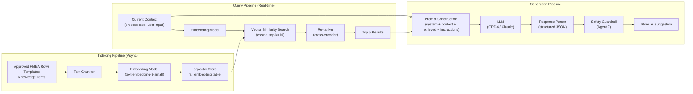

### 9.3 Embedding Strategy

| Content Type | Chunking Strategy | Metadata |
|---|---|---|
| PFMEA Row | One embedding per row: concatenate function + failure mode + effect + cause + controls | `process_type`, `industry`, `material`, `severity` |
| DFMEA Row | One embedding per row: concatenate structure + function + failure mode + effect + cause | `product_type`, `component`, `severity` |
| Knowledge Item | One embedding per item | `category`, `source`, `is_template` |
| Template | One embedding per template row | `template_name`, `process_type` |

**Embedding Model**: OpenAI `text-embedding-3-small` (1536 dimensions)
**Similarity Metric**: Cosine similarity
**Index Type**: HNSW (m=16, ef_construction=64)

### 9.4 AI Agents

#### Agent 1: PFMEA Draft Generator

| Attribute | Value |
|---|---|
| **Trigger** | User clicks "Generate PFMEA from PFD" |
| **Input** | PFD process steps + selected templates + user guidance |
| **RAG Query** | Retrieve similar process steps from historical PFMEAs |
| **Output** | Complete PFMEA rows (functions, failure modes, effects, causes, controls) |
| **Model** | GPT-4 / Claude Sonnet |
| **Temperature** | 0.3 (low creativity, high consistency) |

**Prompt Template:**
```
You are an AIAG & VDA PFMEA expert. Generate PFMEA rows for the following 
process steps.

CONTEXT:
- Industry: {industry}
- Product: {product_name}
- Process: {process_name}

PROCESS STEPS:
{pfd_steps}

SIMILAR HISTORICAL FMEAs (from this organization):
{retrieved_fmea_rows}

TEMPLATES:
{selected_templates}

USER GUIDANCE:
{user_guidance}

For each process step, generate:
1. Functions (what the step should do, with measurable specs)
2. Requirements (tolerances, standards)
3. Failure modes (how it can fail)
4. Effects (at local, next-higher, and end-user levels)
5. Causes (root causes with 4M categories)
6. Prevention controls (prevent the cause)
7. Detection controls (detect the failure)

Return structured JSON. For each suggestion:
- Include a confidence score (0.0–1.0)
- Include rationale explaining why this was suggested
- Cite source references (historical FMEA IDs or template names)
```

#### Agent 2: DFMEA Structure & Function Agent

| Attribute | Value |
|---|---|
| **Trigger** | User creates DFMEA structure or P-diagram |
| **Input** | Design structure tree + P-diagram (if available) |
| **Output** | DFMEA rows (functions, requirements, failure modes, effects, causes) |
| **Model** | GPT-4 / Claude Sonnet |

#### Agent 3: Rating & AP Recommender

| Attribute | Value |
|---|---|
| **Trigger** | User opens rating dialog or requests AI rating |
| **Input** | FMEA row with failure chain (effect → failure mode → cause → controls) |
| **RAG Query** | Retrieve similar rows with existing ratings |
| **Output** | Suggested S, O, D values with individual rationale |
| **Model** | GPT-4 / Claude Sonnet |
| **Temperature** | 0.1 (very consistent) |

**Rating Rationale Format:**
```json
{
  "severity": {
    "suggested_value": 8,
    "confidence": 0.90,
    "rationale": "Effect 'Part does not fit in assembly' affects end-user assembly. 
                  Similar effects in 15 historical rows rated S=7-9. 
                  Median = 8. No safety/regulatory impact reported.",
    "references": [
      {"id": "uuid-row-x", "name": "Project X Row 15", "rating": 8},
      {"id": "uuid-row-y", "name": "Project Y Row 7", "rating": 9}
    ]
  },
  "occurrence": { ... },
  "detection": { ... }
}
```

#### Agent 4: Consistency & Coverage Checker

| Attribute | Value |
|---|---|
| **Trigger** | User clicks "Check Consistency" or automatic on submit |
| **Input** | PFD, PFMEA, CP, DFMEA revisions for a project |
| **Output** | List of issues with severity (critical/warning/info) |

**Checks Performed:**

| Check | Severity | Description |
|---|---|---|
| PFD step without PFMEA | Critical | Process step in PFD has no PFMEA analysis |
| PFMEA without controls | Critical | PFMEA row has no prevention or detection control |
| High AP without action | Warning | High AP row has no associated action |
| CP without PFMEA link | Warning | Control Plan row not linked to any PFMEA row |
| DFMEA special char without PFMEA | Critical | Special characteristic not covered in PFMEA |
| Severity inconsistency | Warning | Same effect rated differently across rows |
| Missing reaction plan | Warning | CP row has no reaction plan defined |
| Orphan entities | Info | Functions/failure modes not linked to any row |

#### Agent 5: Knowledge Reuse Agent

| Attribute | Value |
|---|---|
| **Trigger** | User focuses on FMEA row or requests similar cases |
| **Input** | Current FMEA row context |
| **Output** | Top 5 similar historical FMEA rows with outcomes |

#### Agent 6: Action & Optimization Agent

| Attribute | Value |
|---|---|
| **Trigger** | User requests action suggestions for high-risk row |
| **Input** | High AP FMEA row + similar past rows with successful actions |
| **Output** | Suggested corrective/preventive actions with expected risk reduction |

#### Agent 7: Safety & Compliance Guardrail Agent

| Attribute | Value |
|---|---|
| **Trigger** | Every AI suggestion before display to user |
| **Input** | AI suggestion from any other agent |
| **Output** | Validation result (pass/fail) with corrections |

**Guardrail Rules:**
1. Severity for safety-related effects MUST be ≥ 8
2. All S/O/D values MUST be 1–10
3. AP MUST match the configured AP lookup table
4. No suggestion can reduce severity below the established floor for the effect type
5. Controls must be classified as prevention or detection (not mixed)
6. Confidence below 0.3 → flag for human review
7. No hallucinated references (verify reference IDs exist)

### 9.5 AI Service Architecture

```
src/modules/ai/
├── ai.module.ts
├── controllers/
│   └── ai.controller.ts
├── services/
│   ├── ai-orchestrator.service.ts      # Routes to appropriate agent
│   ├── rag.service.ts                  # RAG pipeline management
│   ├── embedding.service.ts            # Text → vector embedding
│   ├── llm.service.ts                  # LLM provider abstraction
│   └── guardrail.service.ts            # Safety validation
├── agents/
│   ├── pfmea-draft.agent.ts            # Agent 1
│   ├── dfmea-structure.agent.ts        # Agent 2
│   ├── rating-recommender.agent.ts     # Agent 3
│   ├── consistency-checker.agent.ts    # Agent 4
│   ├── knowledge-reuse.agent.ts        # Agent 5
│   ├── action-suggester.agent.ts       # Agent 6
│   └── safety-guardrail.agent.ts       # Agent 7
├── prompts/
│   ├── pfmea-draft.prompt.ts           # Prompt templates
│   ├── dfmea-draft.prompt.ts
│   ├── rating-suggest.prompt.ts
│   ├── consistency-check.prompt.ts
│   └── action-suggest.prompt.ts
├── dto/
│   ├── generate-draft.dto.ts
│   └── suggestion-response.dto.ts
└── pipes/
    └── json-response-parser.pipe.ts    # Parse LLM JSON output
```

### 9.6 LLM Provider Abstraction

```typescript
// src/modules/ai/services/llm.service.ts
interface LLMProvider {
  generateCompletion(request: LLMRequest): Promise<LLMResponse>;
  generateEmbedding(text: string): Promise<number[]>;
  getModelInfo(): ModelInfo;
}

interface LLMRequest {
  systemPrompt: string;
  userPrompt: string;
  temperature: number;
  maxTokens: number;
  responseFormat: 'json' | 'text';
  model?: string;
}

interface LLMResponse {
  content: string;
  usage: { promptTokens: number; completionTokens: number };
  model: string;
  latencyMs: number;
}

// Supported providers:
// - OpenAI (GPT-4, GPT-4o)
// - Anthropic (Claude 3.5 Sonnet, Claude Opus)
// - Azure OpenAI (GPT-4 deployment)
// Provider selected via tenant configuration
```

### 9.7 Data Isolation for AI

```
Per-Tenant RAG Isolation:

1. All ai_embedding rows are scoped by tenant_id
2. Vector search queries ALWAYS include WHERE tenant_id = :tenantId
3. No cross-tenant similarity search is possible
4. Index refresh runs per-tenant on a schedule
5. Tenant deletion cascades to all embeddings
```

---

## 10. Workflow & State Machine Design

### 10.1 Document Revision Lifecycle

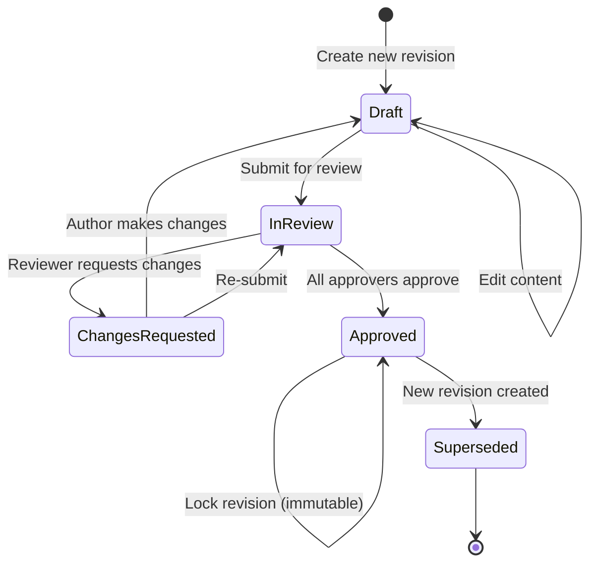

**State Transition Rules:**

| From | To | Actor | Conditions |
|---|---|---|---|
| `Draft` | `InReview` | Quality Engineer | All mandatory fields completed; consistency check passed |
| `InReview` | `ChangesRequested` | Reviewer | At least one reviewer requests changes |
| `InReview` | `Approved` | Approver | All designated approvers approve |
| `ChangesRequested` | `Draft` | System | Automatic on reviewer request |
| `Approved` | `Superseded` | System | When a new revision is created for the same document |

**Approval Rules:**
- Minimum 1 reviewer + 1 approver (configurable per tenant)
- Approver cannot be the same as author
- Approval requires digital signature (name + timestamp + comment)
- Approved revisions are **locked** — no further edits possible

### 10.2 FMEA 7-Step Process Workflow

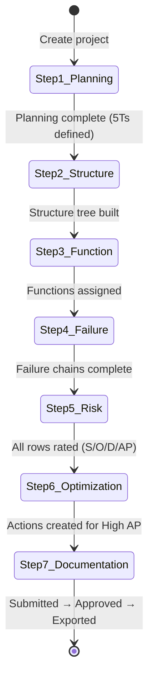

**Step Gating:**
Each step has entry criteria that must be met before proceeding:

| Step | Entry Criteria |
|---|---|
| Step 2 | Project created, team assigned, scope defined |
| Step 3 | Process structure (items + steps + work elements) defined |
| Step 4 | At least one function per process step |
| Step 5 | Every row has: ≥1 failure mode, ≥1 effect, ≥1 cause |
| Step 6 | Every row has S, O, D ratings and calculated AP |
| Step 7 | Every High AP row has an assigned action |

### 10.3 Action Lifecycle

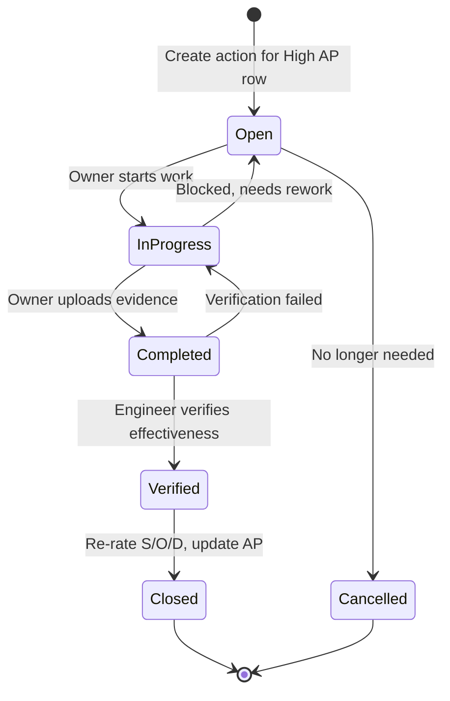

### 10.4 AI Suggestion Lifecycle

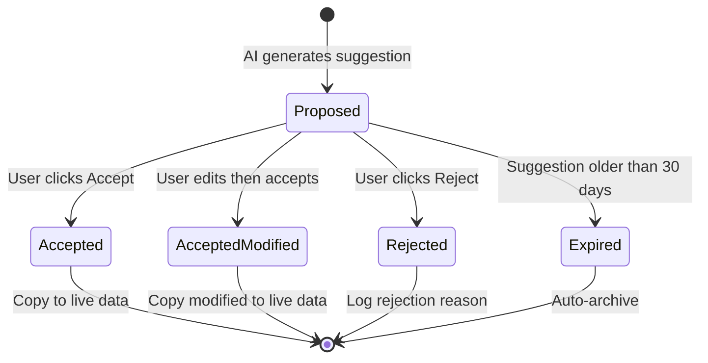

### 10.5 Real-Time Collaboration

**WebSocket Events:**

| Event | Payload | Use Case |
|---|---|---|
| `revision.updated` | `{ revisionId, updatedBy, field }` | Notify co-editors of changes |
| `pfmea-row.created` | `{ rowId, revisionId, createdBy }` | Real-time row addition |
| `pfmea-row.updated` | `{ rowId, fields, updatedBy }` | Cell-level updates |
| `approval.submitted` | `{ revisionId, status }` | Notify approvers |
| `approval.decided` | `{ revisionId, decision, decidedBy }` | Notify author of decision |
| `action.assigned` | `{ actionId, ownerId }` | Notify action owner |
| `action.overdue` | `{ actionId, daysPastDue }` | Overdue alert |
| `ai.suggestion.ready` | `{ entityType, entityId, count }` | AI suggestions available |
| `consistency.check.complete` | `{ revisionId, issueCount }` | Check results ready |

---

## 11. Frontend Architecture

### 11.1 Technology Stack

| Technology | Purpose | Version |
|---|---|---|
| **React** | UI framework | 18+ |
| **TypeScript** | Type safety | 5+ |
| **Material-UI (MUI)** | Component library | 5+ |
| **Redux Toolkit** | Global state management | 2+ |
| **RTK Query** | API data fetching + caching | — |
| **React Router** | Navigation | 6+ |
| **TanStack Table** | FMEA table grids (virtualized) | 8+ |
| **React Hook Form** | Form management | 7+ |
| **Zod** | Schema validation | 3+ |
| **D3.js / Recharts** | Charts and diagrams | — |
| **React Flow** | PFD visual editor | — |
| **Vite** | Build tool | 5+ |

### 11.2 Project Structure

```
src/
├── app/
│   ├── App.tsx
│   ├── router.tsx
│   └── store.ts                        # Redux store configuration
├── features/
│   ├── auth/
│   │   ├── components/
│   │   ├── hooks/
│   │   ├── api/                        # RTK Query endpoints
│   │   └── slices/
│   ├── projects/
│   │   ├── components/
│   │   │   ├── ProjectList.tsx
│   │   │   ├── ProjectForm.tsx
│   │   │   └── ProjectDashboard.tsx
│   │   ├── hooks/
│   │   └── api/
│   ├── pfmea/
│   │   ├── components/
│   │   │   ├── PfmeaWorkspace.tsx      # Main PFMEA screen
│   │   │   ├── ProcessTree.tsx         # Left tree navigation
│   │   │   ├── PfmeaTable.tsx          # TanStack Table grid
│   │   │   ├── PfmeaRowEditor.tsx      # Row detail editor
│   │   │   ├── RatingDialog.tsx        # S/O/D rating dialog
│   │   │   └── ApBadge.tsx             # AP color-coded badge
│   │   ├── hooks/
│   │   │   ├── usePfmeaRows.ts
│   │   │   ├── useApCalculation.ts
│   │   │   └── useAiSuggestions.ts
│   │   └── api/
│   ├── dfmea/
│   │   ├── components/
│   │   │   ├── DfmeaWorkspace.tsx
│   │   │   ├── StructureTree.tsx       # System→Subsystem→Component
│   │   │   ├── PDiagram.tsx            # Parameter diagram editor
│   │   │   └── DfmeaTable.tsx
│   │   └── ...
│   ├── control-plan/
│   │   ├── components/
│   │   │   ├── ControlPlanTable.tsx
│   │   │   └── CpGenerationDialog.tsx
│   │   └── ...
│   ├── pfd/
│   │   ├── components/
│   │   │   ├── PfdTable.tsx            # Tabular PFD editor
│   │   │   └── PfdDiagram.tsx          # Visual flow diagram (React Flow)
│   │   └── ...
│   ├── actions/
│   │   ├── components/
│   │   │   ├── ActionList.tsx
│   │   │   ├── ActionForm.tsx
│   │   │   ├── ActionTimeline.tsx
│   │   │   └── EffectivenessDialog.tsx
│   │   └── ...
│   ├── ai-copilot/
│   │   ├── components/
│   │   │   ├── AiSuggestionPanel.tsx   # Right panel for AI suggestions
│   │   │   ├── SuggestionCard.tsx      # Individual suggestion with accept/reject
│   │   │   ├── ConfidenceBadge.tsx     # Confidence score display
│   │   │   ├── RationalePopover.tsx    # Rationale + citations
│   │   │   └── ConsistencyReport.tsx   # Consistency check results
│   │   └── ...
│   ├── dashboards/
│   │   ├── components/
│   │   │   ├── RiskDashboard.tsx
│   │   │   ├── ActionDashboard.tsx
│   │   │   ├── ComplianceDashboard.tsx
│   │   │   └── CoverageDashboard.tsx
│   │   └── ...
│   └── admin/
│       ├── components/
│       │   ├── UserManagement.tsx
│       │   ├── RoleEditor.tsx
│       │   ├── ApTableConfig.tsx
│       │   └── RatingScaleConfig.tsx
│       └── ...
├── shared/
│   ├── components/
│   │   ├── Layout/
│   │   │   ├── AppShell.tsx            # Header + sidebar + main
│   │   │   ├── Sidebar.tsx
│   │   │   └── Header.tsx
│   │   ├── DataGrid/                   # Reusable TanStack Table wrapper
│   │   ├── TreeView/                   # Reusable tree component
│   │   ├── DiffViewer/                 # Revision comparison
│   │   ├── FileUpload/
│   │   └── NotificationCenter/
│   ├── hooks/
│   │   ├── useAuth.ts
│   │   ├── useTenant.ts
│   │   ├── useWebSocket.ts
│   │   └── usePermissions.ts
│   ├── utils/
│   │   ├── apCalculator.ts            # Client-side AP lookup
│   │   └── formatters.ts
│   └── types/
│       └── index.ts                    # Shared TypeScript types
├── theme/
│   ├── theme.ts                        # MUI theme customization
│   └── palette.ts
└── config/
    └── env.ts
```

### 11.3 Key UI Screens

#### Screen 1: PFMEA Workspace

```
┌──────────────────────────────────────────────────────────────────────┐
│  [Logo]  Brake Caliper Machining PFMEA  Rev 2.0 [Draft]  [👤 Menu] │
├────────┬─────────────────────────────────────────────────┬──────────┤
│ 📁 Nav │ [Step 1] [Step 2] [Step 3] [Step 4] [Step 5]   │  🤖 AI   │
│        │                                                  │  Panel   │
│ ▼ PFD  │ ┌──────────────────────────────────────────┐    │          │
│ ▼ PFMEA│ │ Process Structure (Tree)                  │    │ Suggest- │
│ ▼ DFMEA│ │ ├─ Brake Caliper Machining               │    │ ions     │
│ ▼ CP   │ │   ├─ Step 10: Load raw material           │    │          │
│ ▼ Act. │ │   ├─ Step 20: Clamp part [🔍]             │    │ [AI] Fn: │
│ ▼ Rpts │ │   ├─ Step 30: Drill hole ← selected       │    │ "Create  │
│        │ │   └─ Step 40: Inspect                      │    │ 10mm..." │
│        │ └──────────────────────────────────────────┘    │ 85% ✓✏️✗  │
│        │                                                  │          │
│        │ ┌──────────────────────────────────────────┐    │ [AI] FM: │
│        │ │ PFMEA Table (TanStack Table)              │    │ "Hole    │
│        │ │ ┌────┬──────┬───────┬──────┬────┬───┐    │    │ dia..."  │
│        │ │ │ #  │ Func │  FM   │ Eff  │ S  │AP │    │    │ 78% ✓✏️✗│
│        │ │ ├────┼──────┼───────┼──────┼────┼───┤    │    │          │
│        │ │ │ 1  │ Crea │ Hole  │ Part │ 8  │ H │    │    │ Sources: │
│        │ │ │    │ te   │ dia.  │ won't│    │🔴 │    │    │ [Proj X] │
│        │ │ │    │ 10mm │ out   │ fit  │    │   │    │    │ [Tmpl Y] │
│        │ │ └────┴──────┴───────┴──────┴────┴───┘    │    │          │
│        │ └──────────────────────────────────────────┘    │ 💬 Chat  │
│        │                                                  │          │
│        │ [+ Add Row] [🤖 Generate from PFD] [📊 Check]   │ [Comm-   │
│        │ [💾 Save] [📤 Submit] [📥 Export]               │  ents]   │
└────────┴─────────────────────────────────────────────────┴──────────┘
```

#### Screen 2: AI Suggestion Card (Detail)

```
┌─────────────────────────────────────┐
│ 🤖 AI Suggestion                    │
│                                      │
│ Failure Mode: "Hole diameter out     │
│ of specification"                    │
│                                      │
│ Confidence: ████████░░ 85%           │
│                                      │
│ Rationale:                           │
│ Based on 12 similar drilling ops     │
│ in historical FMEAs. This failure    │
│ mode occurred in 8 of them with      │
│ similar causes and controls.         │
│                                      │
│ Sources:                             │
│ 📄 Machining PFMEA - Project X      │
│    Row 15 (similarity: 92%)         │
│ 📄 Drilling Process - Template Y     │
│    Row 3 (similarity: 87%)          │
│                                      │
│ [✓ Accept] [✏️ Edit] [✗ Reject]     │
└─────────────────────────────────────┘
```

#### Screen 3: Revision Diff View

```
┌─────────────────────────────────────────────────────┐
│ Comparing: Rev 1.0 (Approved) ↔ Rev 2.0 (Draft)    │
├────────────────────────┬────────────────────────────┤
│ Rev 1.0                │ Rev 2.0                    │
├────────────────────────┼────────────────────────────┤
│ Row 3:                 │ Row 3:                     │
│ S=8, O=5, D=6, AP=H   │ S=8, O=2, D=6, AP=M ←🟢  │
│ Control: Manual insp.  │ Control: Tool wear mon. ←🟡│
│                        │ Action: TW-001 (Closed) ←🟢│
├────────────────────────┼────────────────────────────┤
│                        │ Row 7 (NEW):         ←🟢   │
│                        │ Step 35: Deburr edges      │
│                        │ FM: Burr remaining          │
│                        │ S=6, O=4, D=3, AP=M        │
└────────────────────────┴────────────────────────────┘
│ Legend: 🟢 Added  🔴 Removed  🟡 Changed            │
└─────────────────────────────────────────────────────┘
```

### 11.4 PFMEA Table Configuration (TanStack Table)

```typescript
// Column definitions for PFMEA table
const pfmeaColumns: ColumnDef<PfmeaRow>[] = [
  { accessorKey: 'rowNumber', header: '#', size: 50, enablePinning: true },
  { accessorKey: 'processStep.name', header: 'Process Step', size: 150, enablePinning: true },
  { accessorKey: 'workElement.name', header: 'Work Element', size: 120 },
  { 
    id: 'functions', 
    header: 'Function / Requirement',
    size: 200,
    cell: ({ row }) => <MultiEntityCell entities={row.original.functions} type="function" />
  },
  {
    id: 'failureModes',
    header: 'Failure Mode',
    size: 180,
    cell: ({ row }) => <MultiEntityCell entities={row.original.failureModes} type="failure_mode" />
  },
  {
    id: 'effects',
    header: 'Effect of Failure',
    size: 180,
    cell: ({ row }) => <MultiEntityCell entities={row.original.effects} type="effect" />
  },
  { accessorKey: 'severity', header: 'S', size: 50, enableSorting: true },
  {
    id: 'causes',
    header: 'Cause of Failure',
    size: 180,
    cell: ({ row }) => <MultiEntityCell entities={row.original.causes} type="cause" />
  },
  {
    id: 'preventionControls',
    header: 'Prevention Control',
    size: 180,
    cell: ({ row }) => <ControlCell controls={row.original.controls.filter(c => c.type === 'prevention')} />
  },
  {
    id: 'detectionControls',
    header: 'Detection Control',
    size: 180,
    cell: ({ row }) => <ControlCell controls={row.original.controls.filter(c => c.type === 'detection')} />
  },
  { accessorKey: 'occurrence', header: 'O', size: 50 },
  { accessorKey: 'detection', header: 'D', size: 50 },
  {
    accessorKey: 'ap',
    header: 'AP',
    size: 50,
    cell: ({ getValue }) => <ApBadge priority={getValue() as 'H' | 'M' | 'L'} />
  },
  {
    id: 'actions',
    header: 'Actions',
    size: 100,
    cell: ({ row }) => <ActionsSummary actions={row.original.actions} />
  },
];

// Table features:
// - Column pinning (freeze first 2 columns)
// - Virtual scrolling (handle 1000+ rows)
// - Inline editing (click cell → edit mode)
// - Row grouping by process step
// - Column resizing
// - Multi-sort
// - Row selection for bulk operations
```

---

## 12. Security Architecture

### 12.1 Authentication

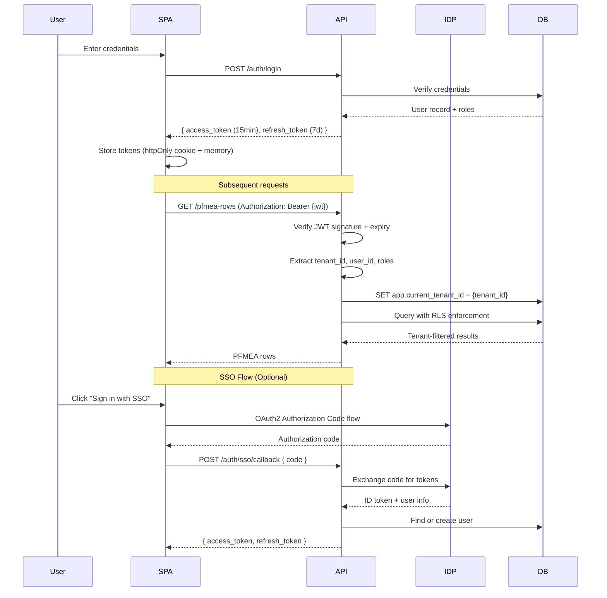

**JWT Token Structure:**
```json
{
  "sub": "uuid-user-id",
  "email": "engineer@tenant.com",
  "tenant_id": "uuid-tenant-id",
  "roles": ["quality_engineer"],
  "permissions": ["pfmea.create", "pfmea.edit", "pfmea.view", "cp.view", "action.create"],
  "iat": 1719216000,
  "exp": 1719216900,
  "iss": "fmea-platform"
}
```

### 12.2 Authorization (RBAC)

**Default Roles:**

| Role | Description | Key Permissions |
|---|---|---|
| **Admin** | Full tenant administration | `*.manage`, `admin.*`, `user.manage` |
| **Quality Engineer** | Create and edit FMEAs | `pfmea.*`, `dfmea.*`, `cp.*`, `pfd.*`, `action.*` |
| **Reviewer** | Comment and review | `*.view`, `*.comment`, `revision.review` |
| **Approver** | Approve revisions | `*.view`, `revision.approve` |
| **Viewer** | Read-only access | `*.view` |

**Permission Codes:**

```
Module: pfmea
  pfmea.view              - View PFMEA rows
  pfmea.view_confidential - View confidential rows
  pfmea.view_restricted   - View restricted rows
  pfmea.create            - Create PFMEA rows
  pfmea.edit              - Edit PFMEA rows
  pfmea.delete            - Delete PFMEA rows
  pfmea.manage            - Full PFMEA administration

Module: revision
  revision.view           - View revisions
  revision.create         - Create new revisions
  revision.submit         - Submit for review
  revision.review         - Review and comment
  revision.approve        - Approve/reject revisions

Module: action
  action.view             - View actions
  action.create           - Create actions
  action.edit             - Edit actions
  action.close            - Close actions

Module: ai
  ai.use                  - Use AI copilot features
  ai.configure            - Configure AI settings

Module: admin
  admin.users             - Manage users
  admin.roles             - Manage roles
  admin.config            - System configuration
  admin.audit             - View audit logs
```

**NestJS Guard Implementation:**
```typescript
@Injectable()
export class PermissionGuard implements CanActivate {
  canActivate(context: ExecutionContext): boolean {
    const requiredPermissions = this.reflector.get<string[]>(
      'permissions', context.getHandler()
    );
    const user = context.switchToHttp().getRequest().user;
    return requiredPermissions.every(p => user.permissions.includes(p));
  }
}

// Usage in controller:
@Get()
@Permissions('pfmea.view')
async getPfmeaRows(@Query() filter: PfmeaFilterDto) { ... }

@Post()
@Permissions('pfmea.create')
async createPfmeaRow(@Body() dto: CreatePfmeaRowDto) { ... }
```

### 12.3 Data Protection

| Area | Implementation |
|---|---|
| **Encryption at rest** | AES-256 (Neon storage encryption, Cloudflare R2 SSE) |
| **Encryption in transit** | TLS 1.3 for all connections |
| **PII handling** | Email/name in user table; minimized in audit logs |
| **Password storage** | bcrypt with cost factor 12 |
| **API keys** | HMAC-SHA256 signed, rotatable |
| **File uploads** | Virus scan on upload (ClamAV), max 50MB per file |
| **CORS** | Whitelist tenant subdomains only |
| **CSP** | Strict Content Security Policy headers |
| **Rate limiting** | Per-tenant, per-endpoint limits via Redis |

### 12.4 Audit Trail Specification

**Every mutation is logged to the `audit_log` table:**

```typescript
// NestJS Interceptor for automatic audit logging
@Injectable()
export class AuditInterceptor implements NestInterceptor {
  intercept(context: ExecutionContext, next: CallHandler): Observable<any> {
    const request = context.switchToHttp().getRequest();
    const method = request.method;

    if (['POST', 'PATCH', 'PUT', 'DELETE'].includes(method)) {
      return next.handle().pipe(
        tap(response => {
          this.auditService.log({
            tenant_id: request.user.tenant_id,
            entity_type: this.getEntityType(request),
            entity_id: response?.id || request.params.id,
            action: this.mapHttpMethodToAction(method),
            old_value: request._oldValue, // captured by pre-handler
            new_value: response,
            user_id: request.user.sub,
            ip_address: request.ip,
            user_agent: request.headers['user-agent'],
          });
        })
      );
    }
    return next.handle();
  }
}
```

**Audit Log Properties:**
- **Immutable**: No UPDATE or DELETE operations on `audit_log` table
- **Complete**: Every field change captured with before/after values
- **Queryable**: Indexed by entity, user, timestamp
- **Exportable**: API endpoint for auditors to download filtered audit reports
- **Partitioned**: By month for performance (archival after 7 years per IATF 16949)

---

## 13. Cross-Cutting Concerns

### 13.1 Observability

| Concern | Technology | Details |
|---|---|---|
| **Metrics** | Prometheus + Grafana | Request latency, error rates, AI suggestion acceptance rate, AP distribution |
| **Logging** | Loki / ELK Stack | Structured JSON logs, correlation IDs, log levels |
| **Tracing** | OpenTelemetry + Jaeger | Distributed tracing across services |
| **Alerting** | Grafana Alerts / PagerDuty | Error rate > 1%, P99 latency > 2s, AI failure rate > 5% |

**Key Metrics:**

| Metric | Type | Alert Threshold |
|---|---|---|
| `http_request_duration_seconds` | Histogram | P99 > 2s |
| `http_requests_total` | Counter | Error rate > 1% |
| `ai_suggestion_latency_seconds` | Histogram | P95 > 30s |
| `ai_suggestion_acceptance_rate` | Gauge | < 30% (quality issue) |
| `fmea_rows_total` | Counter | — |
| `active_users_count` | Gauge | — |
| `pending_actions_count` | Gauge | > 100 per tenant |
| `approval_queue_size` | Gauge | > 50 |

### 13.2 Caching Strategy

| Data | Cache Layer | TTL | Invalidation |
|---|---|---|---|
| User permissions | Redis | 15 min | On role change |
| AP lookup table | Redis + in-memory | 24 hrs | On config update |
| Rating scale descriptions | Redis | 24 hrs | On config update |
| Project list | Redis | 5 min | On project CRUD |
| FMEA row (read-heavy) | Redis | 2 min | On row update |
| AI embeddings | pgvector (persistent) | — | On re-index |

### 13.3 Background Job Queue

**Technology**: BullMQ (Redis-based)

**Job Types:**

| Queue | Job | Priority | Timeout | Retries |
|---|---|---|---|---|
| `ai-generation` | PFMEA/DFMEA draft generation | Normal | 120s | 2 |
| `ai-rating` | Rating suggestions | High | 30s | 3 |
| `ai-consistency` | Consistency check | Normal | 60s | 2 |
| `export` | Excel/PDF export | Low | 300s | 1 |
| `notification` | Email/in-app notifications | Normal | 30s | 3 |
| `embedding` | Index FMEA rows to pgvector | Low | 600s | 2 |
| `audit` | Audit log write (if async) | High | 5s | 5 |

### 13.4 Error Handling

```typescript
// Global exception filter
@Catch()
export class GlobalExceptionFilter implements ExceptionFilter {
  catch(exception: unknown, host: ArgumentsHost) {
    const response = host.switchToHttp().getResponse();
    
    if (exception instanceof HttpException) {
      return response.status(exception.getStatus()).json({
        type: `https://fmea-platform.com/errors/${exception.constructor.name}`,
        title: exception.message,
        status: exception.getStatus(),
        detail: exception.getResponse(),
        instance: host.switchToHttp().getRequest().url,
        timestamp: new Date().toISOString(),
        correlationId: host.switchToHttp().getRequest().correlationId,
      });
    }

    // Unhandled error
    this.logger.error('Unhandled exception', exception);
    return response.status(500).json({
      type: 'https://fmea-platform.com/errors/internal',
      title: 'Internal Server Error',
      status: 500,
      timestamp: new Date().toISOString(),
    });
  }
}
```

### 13.5 Internationalization (i18n)

- Initial release: English only
- Architecture supports i18n via `react-i18next`
- All user-facing strings externalized to translation files
- S/O/D rating descriptions and AP labels are translatable
- Date/number formatting via `Intl` API

---

## 14. Integration Architecture

### 14.1 PLM Integration (Teamcenter, Windchill)

| Capability | Direction | Protocol | Details |
|---|---|---|---|
| Import BOM structure | PLM → FMEA | REST API | Import product structure for DFMEA |
| Import design specs | PLM → FMEA | REST API | Import requirements/specifications |
| Export FMEA results | FMEA → PLM | REST API | Push approved FMEA to PLM as linked document |
| Sync special characteristics | Bidirectional | Webhook | Keep special chars in sync |

### 14.2 ERP Integration (SAP, Oracle)

| Capability | Direction | Protocol | Details |
|---|---|---|---|
| Import part master data | ERP → FMEA | REST/RFC | Part numbers, descriptions, materials |
| Sync process routings | ERP → FMEA | REST/RFC | Manufacturing routings → PFD steps |
| Export control parameters | FMEA → ERP | REST/RFC | Control plan specs to quality module |

### 14.3 MES Integration

| Capability | Direction | Protocol | Details |
|---|---|---|---|
| Push control parameters | FMEA → MES | REST/OPC-UA | SPC limits, inspection frequencies |
| Receive quality data | MES → FMEA | Webhook | Actual defect rates to validate Occurrence ratings |

### 14.4 SSO Integration

- **Protocol**: OAuth 2.0 / OpenID Connect
- **Providers**: Azure AD, Okta, Google Workspace
- **Flow**: Authorization Code with PKCE
- **Auto-provisioning**: Create user on first SSO login (JIT provisioning)

### 14.5 Webhook System

```typescript
// Outbound webhooks for external integrations
interface WebhookEvent {
  event_type: string;
  tenant_id: string;
  timestamp: string;
  data: Record<string, any>;
  signature: string; // HMAC-SHA256
}

// Event types:
// - fmea.revision.approved
// - fmea.row.created
// - fmea.row.updated
// - action.created
// - action.closed
// - control_plan.updated
```

---

## 15. Implementation Roadmap

### 15.1 Phase Overview

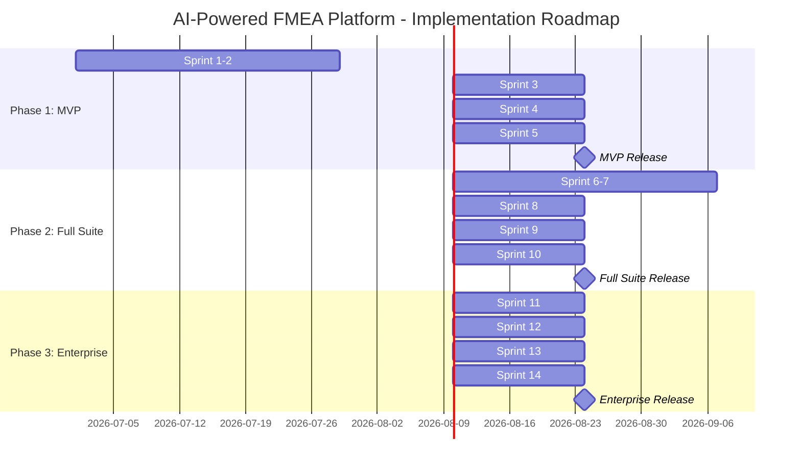

### 15.2 Phase 1: MVP (8–10 weeks, 5 sprints)

**Goal:** Working PFMEA + Control Plan with basic AI assistance

| Sprint | Duration | Deliverables |
|---|---|---|
| **Sprint 1–2** | 4 weeks | Repository setup, CI/CD, dev environment<br/>DB schema v1 (tenant → document_revision)<br/>Auth APIs (login, JWT, refresh, SSO stub)<br/>Project CRUD APIs + UI<br/>Document/Revision CRUD + basic UI |
| **Sprint 3** | 2 weeks | PFD tabular editor (process steps, work elements)<br/>PFMEA table view (tree + TanStack Table)<br/>Entity CRUD (function, failure_mode, effect, cause, control)<br/>PFD ↔ PFMEA bidirectional linking |
| **Sprint 4** | 2 weeks | Control Plan table (CP rows, characteristics)<br/>PFMEA → CP auto-generation<br/>Action CRUD + assignment + evidence upload<br/>Email notifications for action assignments |
| **Sprint 5** | 2 weeks | AI Agent 1: PFMEA draft generator<br/>Vector store setup (pgvector, embedding pipeline)<br/>AI suggestion UI (accept/edit/reject)<br/>Risk dashboard (AP distribution chart)<br/>Excel/PDF export in AIAG–VDA format<br/>**MVP Release Candidate** |

### 15.3 Phase 2: Full FMEA Suite (8–10 weeks, 5 sprints)

**Goal:** DFMEA, Knowledge Base, Advanced AI, Diff View

| Sprint | Duration | Deliverables |
|---|---|---|
| **Sprint 6–7** | 4 weeks | DFMEA workspace + structure tree<br/>P-Diagram editor<br/>DFMEA ↔ PFMEA special characteristic linking<br/>Fault Tree & Event Tree (basic) |
| **Sprint 8** | 2 weeks | Knowledge Base (templates, master FMEAs, knowledge items)<br/>"Save as Template" workflow<br/>Template browser + search |
| **Sprint 9** | 2 weeks | AI Agent 2: DFMEA generator<br/>AI Agent 3: Rating recommender<br/>AI Agent 4: Consistency checker<br/>AI Agent 5: Knowledge reuse |
| **Sprint 10** | 2 weeks | Revision diff view (side-by-side comparison)<br/>Row-level audit trail UI<br/>Action effectiveness tracking (before/after)<br/>Advanced reporting |

### 15.4 Phase 3: Enterprise & Compliance (8–12 weeks, 4 sprints)

**Goal:** Multi-plant, integrations, compliance features

| Sprint | Duration | Deliverables |
|---|---|---|
| **Sprint 11** | 2 weeks | Multi-plant hierarchy support<br/>Granular row-level permissions<br/>Advanced RBAC configuration |
| **Sprint 12** | 2 weeks | PLM integration (Teamcenter/Windchill)<br/>ERP integration (SAP stub)<br/>Webhook system |
| **Sprint 13** | 2 weeks | AI Agent 6: Action suggester<br/>AI Agent 7: Safety guardrail<br/>AI model configuration per tenant |
| **Sprint 14** | 2 weeks | E-signature support (21 CFR Part 11 ready)<br/>IATF 16949 compliance report generator<br/>On-prem deployment option (Helm charts)<br/>Performance optimization (caching, lazy loading) |

### 15.5 Team Composition

| Role | Count | Responsibilities |
|---|---|---|
| **Tech Lead / Architect** | 1 | Architecture decisions, code reviews, technical direction |
| **Backend Engineers** | 2–3 | NestJS services, APIs, database, integrations |
| **Frontend Engineers** | 2 | React UI, TanStack Table, D3.js charts |
| **AI/ML Engineer** | 1 | RAG pipeline, prompt engineering, LLM integration |
| **DevOps/SRE** | 1 | CI/CD, Kubernetes, monitoring, infrastructure |
| **QA Engineer** | 1 | Test strategy, E2E tests, performance testing |
| **UX Designer** | 0.5 | UI design, usability testing (part-time) |
| **Product Manager** | 0.5 | Requirements, stakeholder management (part-time) |

---

## 16. Testing Strategy

### 16.1 Test Pyramid

```
          ┌─────────┐
          │  E2E    │  5-10 critical user journeys (Playwright)
          │  Tests  │
         ┌┴─────────┴┐
         │ Integration│  API flows, DB constraints, auth (Supertest)
         │   Tests    │
        ┌┴────────────┴┐
        │  Unit Tests   │  Business logic, AP calc, formatters (Jest)
        └───────────────┘
```

### 16.2 Unit Tests

**Scope:** Pure business logic, no external dependencies

| Module | Key Test Cases |
|---|---|
| **AP Calculator** | All S×O×D combinations produce correct H/M/L |
| **Rating Validation** | S/O/D must be 1–10, reject invalid values |
| **Link Enforcement** | PFMEA row must have process step, CP row must have characteristic |
| **Prompt Construction** | AI prompts include correct context + retrieved data |
| **Response Parsing** | AI JSON responses parsed correctly, invalid JSON handled |
| **Permission Logic** | Role → permission resolution correct |

**Example:**
```typescript
describe('AP Calculator', () => {
  it('calculates AP=H for S=9, O=5, D=6', () => {
    expect(calculateAP(9, 5, 6, defaultApTable)).toBe('H');
  });

  it('calculates AP=L for S=2, O=1, D=1', () => {
    expect(calculateAP(2, 1, 1, defaultApTable)).toBe('L');
  });

  it('throws for invalid severity', () => {
    expect(() => calculateAP(11, 5, 6, defaultApTable)).toThrow();
  });
});
```

### 16.3 Integration Tests

**Scope:** API endpoints, database interactions, auth flows

| Area | Key Test Cases |
|---|---|
| **Auth** | Login, JWT refresh, expired token, invalid credentials |
| **PFMEA CRUD** | Create row with entities, update S/O/D → AP recalculated |
| **Revision Workflow** | Submit → Review → Approve → Lock → Cannot edit |
| **Tenant Isolation** | User A cannot access Tenant B data |
| **Permission Enforcement** | Viewer cannot edit, Reviewer cannot approve |
| **CP Generation** | Generate CP from PFMEA, verify links created |
| **Audit Logging** | All mutations produce audit log entries |

### 16.4 E2E Tests

**Scope:** Complete user journeys through the UI

| Journey | Steps |
|---|---|
| **PFMEA Creation** | Login → Create project → Create PFD → Generate PFMEA (AI) → Accept suggestions → Rate S/O/D → Create actions → Submit → Approve → Export |
| **Action Lifecycle** | Create action for High AP → Assign owner → Start → Upload evidence → Verify → Re-rate → Close |
| **Revision Comparison** | Create Rev 1 → Approve → Create Rev 2 → Make changes → View diff → Submit Rev 2 |

### 16.5 AI-Specific Tests

| Test Type | Details |
|---|---|
| **Accuracy Benchmark** | Compare AI suggestions against expert-created FMEAs (target: 70%+ acceptance rate) |
| **Confidence Calibration** | High confidence suggestions should have higher acceptance rate |
| **Guardrail Tests** | Safety-critical effects must have S ≥ 8; invalid S/O/D values rejected |
| **Latency Tests** | Draft generation < 30s; rating suggestion < 5s |
| **Tenant Isolation** | RAG queries only return same-tenant data |
| **Prompt Injection** | Malicious user input in guidance field doesn't affect prompt behavior |

### 16.6 Performance Targets

| Metric | Target |
|---|---|
| **API response time** | P95 < 500ms (CRUD), P95 < 2s (search) |
| **AI draft generation** | < 30s for 10 process steps |
| **AI rating suggestion** | < 5s per row |
| **PFMEA table load** | < 2s for 500 rows with virtualization |
| **Excel export** | < 10s for 1000-row FMEA |
| **Concurrent users** | 100 per tenant, 1000 total |
| **Database query time** | P95 < 100ms |

---

## 17. Appendices

### Appendix A: AIAG–VDA AP Lookup Table (Default)

The complete 10×10×10 Action Priority lookup table. This is the default configuration; tenants can customize.

> [!NOTE]
> The full AP table contains 1000 entries mapping every (S, O, D) combination to H, M, or L. It is stored as a JSONB configuration in the `tenant.settings` field and cached in Redis.

**Key AP Rules (Summary):**

| Severity | Occurrence | Detection | AP |
|---|---|---|---|
| 9–10 | Any ≥ 2 | Any | **H** |
| 9–10 | 1 | ≥ 4 | **H** |
| 9–10 | 1 | 1–3 | **M** |
| 7–8 | ≥ 5 | Any | **H** |
| 7–8 | 3–4 | ≥ 5 | **H** |
| 7–8 | 3–4 | 1–4 | **M** |
| 7–8 | 1–2 | ≥ 5 | **M** |
| 7–8 | 1–2 | 1–4 | **L** |
| 4–6 | ≥ 7 | Any | **H** |
| 4–6 | 5–6 | ≥ 7 | **H** |
| 4–6 | 5–6 | 1–6 | **M** |
| 4–6 | 3–4 | ≥ 5 | **M** |
| 4–6 | 3–4 | 1–4 | **L** |
| 4–6 | 1–2 | Any | **L** |
| 1–3 | Any | Any | **L** |

### Appendix B: S/O/D Rating Scale Descriptions (Default)

**Severity Scale:**

| Rating | Description |
|---|---|
| 10 | May endanger operator/user. Safety/regulatory non-compliance. No warning. |
| 9 | May endanger operator/user. Safety/regulatory non-compliance. With warning. |
| 8 | Loss of primary function. 100% of product affected, must be scrapped. |
| 7 | Degradation of primary function. Product sortable, partial scrap. |
| 6 | Loss of secondary function. Customer dissatisfied. |
| 5 | Degradation of secondary function. Customer somewhat dissatisfied. |
| 4 | Appearance/fit/finish. Most customers notice. |
| 3 | Appearance/fit/finish. Average customers notice. |
| 2 | Appearance/fit/finish. Discriminating customers notice. |
| 1 | No discernible effect. |

**Occurrence Scale:**

| Rating | Description |
|---|---|
| 10 | New technology. No preventive controls. ≥ 100 per 1000 |
| 9 | Similar to existing. No preventive controls. 50 per 1000 |
| 8 | Similar to existing. Troublesome. 20 per 1000 |
| 7 | Similar to existing. Somewhat troublesome. 10 per 1000 |
| 6 | Similar to existing with some change. 2 per 1000 |
| 5 | Similar to existing with minor changes. 0.5 per 1000 |
| 4 | Mature design. Some preventive controls. 0.1 per 1000 |
| 3 | Mature design. Effective preventive controls. 0.01 per 1000 |
| 2 | Proven design with preventive controls. ≤ 0.001 per 1000 |
| 1 | Failure eliminated through preventive controls. |

**Detection Scale:**

| Rating | Description |
|---|---|
| 10 | No current controls. Cannot detect or is not analyzed. |
| 9 | Failure mode and/or error (cause) is not easily detected. |
| 8 | Detection at downstream processing or by operator. |
| 7 | Detection at the station by operator (visual/tactile/audible). |
| 6 | Detection at the station by operator (gauging or inspection). |
| 5 | Detection at the station by automated controls. |
| 4 | Detection by automated controls that will prevent further processing. |
| 3 | Detection by automated controls that will isolate and prevent further processing. |
| 2 | Error detection and/or fault prevention. Error proofing verified. |
| 1 | Detection not applicable. Error proofing by design. |

### Appendix C: Technology Version Matrix

| Technology | Version | Purpose |
|---|---|---|
| Node.js | 20 LTS | Runtime |
| NestJS | 10+ | Backend framework |
| React | 18+ | Frontend framework |
| TypeScript | 5+ | Language |
| PostgreSQL | 15+ | Primary database |
| pgvector | 0.7+ | Vector similarity search |
| Prisma | 5+ | ORM |
| Redis | 7+ | Cache + job queue |
| BullMQ | 5+ | Background job queue |
| Material-UI | 5+ | Component library |
| TanStack Table | 8+ | Data grid |
| React Router | 6+ | Routing |
| Redux Toolkit | 2+ | State management |
| Vite | 5+ | Build tool |
| Docker | 24+ | Containerization |
| Kubernetes | 1.28+ | Orchestration |
| Helm | 3+ | K8s package management |
| Playwright | 1.40+ | E2E testing |
| Jest | 29+ | Unit testing |

### Appendix D: Glossary

| Term | Definition |
|---|---|
| **AIAG** | Automotive Industry Action Group (USA) |
| **VDA** | Verband der Automobilindustrie (German automotive association) |
| **FMEA** | Failure Mode and Effects Analysis |
| **DFMEA** | Design FMEA — analyzes product design failures |
| **PFMEA** | Process FMEA — analyzes manufacturing process failures |
| **AP** | Action Priority (H/M/L) — replaces RPN in AIAG–VDA 2019 |
| **RPN** | Risk Priority Number (legacy: S × O × D) |
| **PFD** | Process Flow Diagram |
| **CP** | Control Plan |
| **S/O/D** | Severity / Occurrence / Detection ratings (1–10) |
| **RAG** | Retrieval-Augmented Generation |
| **IATF 16949** | Automotive Quality Management System standard |
| **5Ts** | FMEA planning elements: Intent, Timing, Team, Tasks, Tools |
| **Special Characteristic** | Critical product feature requiring extra process control |
| **RLS** | Row-Level Security (PostgreSQL feature) |
| **RBAC** | Role-Based Access Control |
| **HPA** | Horizontal Pod Autoscaler (Kubernetes) |

---

*End of Document*

*Generated: 2026-06-24 | Source: Notion Workspace "Vk S's Space" → "AI Powered FMEA" project (11 pages)*
